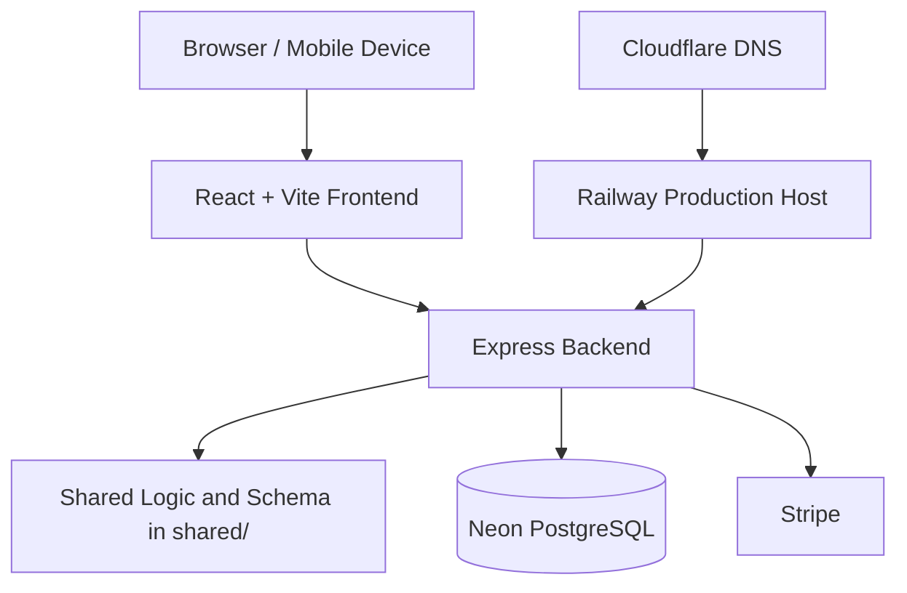

# Volume 03 - System Architecture

## Document Metadata

| Field | Value |
| --- | --- |
| Purpose | Document the current production architecture of CreteXchange. |
| Scope | Production behavior only; no speculative or planned features. |
| Version | 1.0 |
| Status | Active |
| Last Updated | 2026-06-25 |
| Maintained By | CreteXchange engineering and operations |

## Revision History

| Date | Version | Author | Notes |
| --- | --- | --- | --- |
| 2026-06-25 | 1.0 | Codex | Initial system architecture volume created. |

## Overall Platform Architecture

CreteXchange is a role-based production web application deployed on Railway, backed by Neon PostgreSQL, and routed through Cloudflare DNS under the production domain `https://cretexchange.app`.

The platform is organized around a shared frontend, an Express backend, and common business logic in `shared/`.

## React Frontend

The frontend is a React application built with Vite. It renders the role-specific user experience for drivers, owners, admins, and super-admins.

Current frontend responsibilities:

- dashboard pages
- billing preview and reporting screens
- wallet and accounting screens
- driver activity, profile, and lottery flows
- owner washout review and approval flows
- legal document presentation and acceptance flows
- responsive/mobile navigation

The frontend uses shared UI primitives and design-system components for consistent layout and contrast.

## Express Backend

The backend is an Express application that serves the frontend and provides the APIs used by the production UI.

Current backend responsibilities:

- session and authentication handling
- role-based authorization
- storage and data-access orchestration
- billing preview and live billing workflows
- wallet/accounting summaries
- legal document versioning and acceptance recording
- internal messages and notifications

## API Organization

The API is organized around application domains and user roles.

| Domain | Current Behavior |
| --- | --- |
| Driver | Driver dashboard, activity, wallet, profile, lottery entries, terms status, terms acceptance |
| Owner | Owner dashboard, billing preview, wallet/accounting, terms status, terms acceptance |
| Admin | Billing settings, reporting, billing runs, terms management, operational dashboards |
| Shared | Auth/session, legal documents, shared billing helpers, shared accounting helpers |

The current production routes are role-aware and map to the same underlying production data sources.

## Authentication

Production uses authenticated sessions to identify the current user.

Current behavior:

- requests are tied to the current logged-in user session
- routes read the authenticated user before returning protected data
- the frontend waits for user/session resolution before showing protected workflows

## Authorization

Authorization is enforced by role.

Current behavior:

- driver routes are available to authenticated driver users
- owner routes are available to authenticated owner users
- admin and super-admin routes are restricted to privileged roles
- terms acceptance and billing operations are gated to the relevant authenticated identity

## Railway Deployment

Railway is the production host for the application.

Current operational behavior:

- production changes are deployed from the Railway-tracking production repository and branch
- production verification should use the runtime startup commit hash
- the deployed commit hash is used to confirm the exact revision running in production

## Neon PostgreSQL

Neon PostgreSQL is the production database.

Current behavior:

- it stores application state, billing data, wallet/accounting data, legal acceptance records, and operational history
- the backend reads live production rows rather than synthesizing production truth client-side

## Cloudflare DNS

Cloudflare provides DNS for the public production domain.

Current behavior:

- `cretexchange.app` is the public production domain
- DNS routes traffic to the Railway deployment

## Stripe Integration

Stripe is used for payment execution and transfer-related workflows.

Current behavior:

- live payment execution uses Stripe
- transfer-related flows use Stripe when production billing is executed
- the dry-run billing preview does not call Stripe

## Billing Engine

The billing engine uses a shared canonical ledger calculator.

Current behavior:

- dry-run billing and live billing use shared billing policy code
- driver tip source is `washout_activities.amount`
- platform fee behavior follows the current production platform-fee logic
- owner/location-configured driver incentive tips are separate from platform fees
- billing preview does not write billing success records

## Wallet Accounting

Wallet/accounting views reflect completed production records.

Current behavior:

- completed `billing_batches` are included in owner spend calculations
- owner transaction history includes billing batch rows
- average monthly spend derives from completed billing/accounting totals
- wallet/accounting views read from persisted production records rather than ad hoc UI state

## Lottery System

The lottery system is driver-facing and tied to recorded driver participation.

Current behavior:

- driver lottery entries are stored and queried from production data
- lottery entry views are authenticated driver views
- entry lists should only be empty when the API returns an empty result set

## Photo Approval Workflow

Photo approval and washout review are part of the owner workflow.

Current behavior:

- owners review washout activity and associated photos
- approval or rejection updates the washout status
- approved washouts feed billing and accounting workflows

## Messaging

The platform writes internal support and operational messages.

Current behavior:

- support/admin messages are stored in the messages table
- messaging may be used as a non-essential operational side effect in some workflows
- non-essential message failures should not block the underlying business action when the core write succeeds

## Notification System

The application includes notification storage and user-facing notification surfaces.

Current behavior:

- system notifications are persisted in the notifications table
- lottery notifications exist as a separate notification record path
- notification data is used by the relevant role-specific UI surfaces

## Legal Document System

Legal documents are managed through a versioned document system.

Current behavior:

- current legal versions are stored in `terms_versions`
- user acceptance is stored in `terms_acceptances`
- legal documents include Terms & Conditions, Owner Agreement, Driver Agreement, and Privacy Policy
- the UI should present the current version/effective date with the document

## Current Production Topology

Current topology in production:

1. Client browser loads the React frontend.
2. Frontend requests authenticated data from the Express backend.
3. Backend reads and writes production state in Neon PostgreSQL.
4. Backend executes live payment actions through Stripe when needed.
5. Cloudflare DNS routes the public domain to Railway.
6. Railway hosts the deployed application and exposes the startup commit hash for verification.

## Scope Note

This volume documents current production behavior only. It does not describe legacy Replit deployment details as a production target, and it does not invent future architecture.

