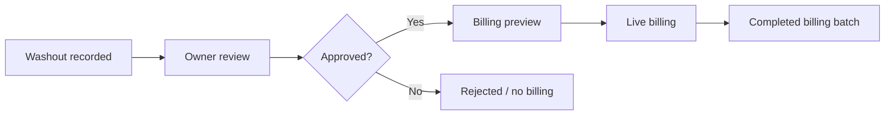

# Volume 04 - Operations Manual

## Document Metadata

| Field | Value |
| --- | --- |
| Purpose | Describe current production workflows and operational procedures. |
| Scope | Production operations only; no speculative or planned processes. |
| Version | 1.0 |
| Status | Active |
| Last Updated | 2026-06-25 |
| Maintained By | CreteXchange engineering and operations |

## Revision History

| Date | Version | Author | Notes |
| --- | --- | --- | --- |
| 2026-06-25 | 1.0 | Codex | Initial operations manual created. |

## Administrator Workflow

### Daily Tasks

| Task | Purpose |
| --- | --- |
| Review admin dashboard | Confirm system status and current operational health |
| Review billing settings | Confirm current billing behavior and cadence |
| Review reports and warnings | Identify route failures, billing anomalies, or approval issues |
| Review legal acceptance behavior | Confirm terms acceptance flows are operating |
| Verify high-priority user reports | Investigate production regressions quickly |

### Weekly Tasks

| Task | Purpose |
| --- | --- |
| Review billing and reporting trends | Confirm billing output matches expected production behavior |
| Review terms and legal document state | Confirm current versions and acceptance tracking |
| Review notifications/messages | Confirm operational workflows are not failing silently |

## Owner Workflow

| Step | Description |
| --- | --- |
| Review washouts | Inspect washout activity and associated photos |
| Approve or reject | Update washout status to match operational reality |
| Review billing preview | Confirm platform fees and driver-tip totals before live execution |
| Review wallet/accounting | Confirm completed billing batches and historical spend |
| Accept terms when prompted | Complete legal acceptance before using protected features |

Operational note:

- Owners are not currently charged recurring subscription fees.
- Owners may still be charged per-washout platform fees.
- Owner/location-configured driver incentive tips are separate from platform fees.

## Driver Workflow

| Step | Description |
| --- | --- |
| Review dashboard | See current status, earnings, and operational summaries |
| Review activity | Inspect recent washouts and related information |
| Review lottery participation | View entries and status information |
| Review wallet/earnings | Confirm accounting and payout-related data |
| Accept terms when required | Complete legal acceptance before continuing |

## Washout Lifecycle

Current operational behavior:

1. Washout activity is recorded.
2. Owner reviews and approves or rejects it.
3. Approved washouts are eligible for billing preview.
4. Live billing uses the shared canonical ledger.
5. Completed billing batches feed owner spend/accounting views.

## Billing Workflow

| Step | Description |
| --- | --- |
| Preview | Use the dry-run endpoint to inspect totals |
| Validate | Confirm platform fees, driver tips, and owner charge totals |
| Execute | Run live billing only after the preview is correct |
| Persist | Record completed billing and accounting rows |
| Verify | Compare output to the expected production behavior |

Operational rules:

- The dry-run endpoint is read-only and does not call Stripe.
- Driver tips are sourced from `washout_activities.amount`.
- The shared ledger calculator is the canonical calculation path.
- Billing success records are only written by live billing, not dry-run.

## Wallet Accounting Process

Current behavior:

- completed `billing_batches` are included in owner spend totals
- billing batch rows appear in owner transaction history
- average monthly spend is derived from completed billing/accounting totals
- pending approval counts must not be substituted for spend totals

Checklist:

- Confirm the owner has completed billing batches
- Confirm the transaction feed includes billing batch rows
- Confirm analytics totals match persisted accounting data

## Lottery Operations

Current behavior:

- lottery entries are tied to the authenticated driver
- lottery data is retrieved from the production API
- empty entries lists are valid only when the API returns an empty list

Operational guidance:

- If a driver sees no entries unexpectedly, check authentication and query scoping first
- If the route returns 401, treat it as an auth/session issue rather than an empty result

## Terms Acceptance Process

Current behavior:

1. Resolve the current legal-document version.
2. Present the document to the user.
3. Record acceptance in storage.
4. Optionally write a support/admin message.

Operational rules:

- The acceptance write is the important business action.
- A support-message failure should not block acceptance once the acceptance write succeeds.
- If a terms route fails, check version initialization, acceptance write, and auth/session state first.

## Driver Onboarding

Current behavior:

- driver onboarding depends on authenticated driver data
- profile data and terms acceptance are shown before or during onboarding steps
- the UI should clearly show current status and required actions

Checklist:

- Confirm driver identity/session
- Confirm required legal documents are current
- Confirm profile data is displayed correctly

## Owner Onboarding

Current behavior:

- owner onboarding depends on authenticated owner data
- legal acceptance and billing setup are part of the owner experience
- current production billing behavior should be presented as it actually exists

Checklist:

- Confirm owner identity/session
- Confirm terms acceptance state
- Confirm billing/accounting views are available

## Deployment Workflow

Current production deployment workflow:

1. Make the smallest safe change in the Railway worktree that tracks production.
2. Run `npm run check`.
3. Run `npm run build`.
4. Commit the change.
5. Push to the production branch.
6. Redeploy Railway.
7. Verify the startup commit hash.

## Daily Checklist

- Review dashboards for 500/401 errors
- Review billing preview and live billing behavior if changed
- Review owner wallet/accounting totals
- Review driver lottery and terms acceptance behavior
- Confirm no unresolved temporary diagnostics remain

## Weekly Checklist

- Compare billing and accounting totals against expected completed batches
- Review terms status and acceptance records
- Review notifications/messages for operational failures
- Check for contrast or readability regressions in dark UI surfaces

## Monthly Checklist

- Review billing cadence and completed billing batches
- Review wallet/accounting rollups
- Review lottery output for the month
- Review legal-document versions and any required reacceptance behavior

## Incident Response

When a production issue is reported:

1. Confirm the deployed commit hash.
2. Identify the exact route, role, and user flow.
3. Determine whether the issue is auth, data, UI, or storage related.
4. Fix the narrowest layer that explains the failure.
5. Verify with `npm run check` and `npm run build`.
6. Redeploy and confirm the runtime hash.

## Disaster Recovery

Recovery behavior:

- use git history to return to a known-good commit
- deploy the verified commit on Railway
- confirm the startup hash matches the deployed revision
- validate the affected route before resuming normal work

## Production Deployment Checklist

Before deployment:

- [ ] Confirm the production repository and branch
- [ ] Confirm the worktree is on the correct production line
- [ ] Run `npm run check`
- [ ] Run `npm run build`
- [ ] Review the diff for scope discipline
- [ ] Confirm no billing, Stripe, schema, or legal-text changes are accidental

After deployment:

- [ ] Confirm the startup commit hash
- [ ] Verify the user-facing workflow
- [ ] Check for 500s and 401s on the changed area
- [ ] Remove any temporary logs that are no longer needed

## Scope Note

This manual describes current production operations only. It does not invent future workflows or expand beyond what is already deployed.

