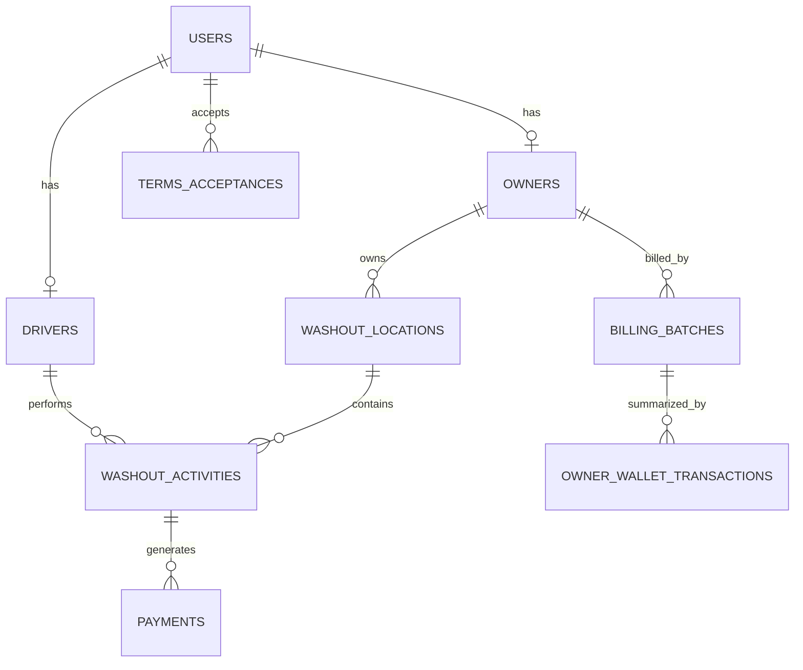

# Volume 08 - Data Dictionary

## Document Metadata

| Field | Value |
| --- | --- |
| Purpose | Document the major production tables, relationships, and source-of-truth rules. |
| Scope | Production schema behavior only; no speculative tables or columns. |
| Version | 1.0 |
| Status | Active |
| Last Updated | 2026-06-25 |
| Maintained By | CreteXchange engineering and operations |

## Revision History

| Date | Version | Author | Notes |
| --- | --- | --- | --- |
| 2026-06-25 | 1.0 | Codex | Initial data dictionary volume created. |

## Data Dictionary Overview

CreteXchange production data is organized around a small set of core entities:

- users and role-specific profile tables
- washout locations, activities, and photos
- billing and wallet/accounting tables
- terms and legal acceptance tables
- lottery tables
- messaging and notification tables

## Source-of-Truth Rules

| Rule | Meaning |
| --- | --- |
| Live database first | Production behavior must come from Neon PostgreSQL rows, not client-side guesses |
| Shared billing policy | Dry-run and live billing should use the shared canonical ledger logic |
| Completed billing batches matter | Owner spend and transaction history include completed billing batches |
| Driver tip source | Current production driver-tip source is `washout_activities.amount` |
| Platform fees separate | Owner/location-configured tips are separate from platform fees |
| Legal acceptance | Acceptance is recorded in `terms_acceptances` and linked owner/driver state |

## Wallet Accounting Rules

| Rule | Meaning |
| --- | --- |
| Spend totals | Owner total spend includes completed billing batches |
| Transaction history | Owner history includes `billing_batches`-backed accounting rows |
| Monthly average | Average monthly spend is derived from completed accounting totals |
| Pending approval | Pending approvals are not a substitute for spend totals |
| Driver wallet | Driver wallet and transaction tables are separate from owner wallet accounting |

## Major Tables by Domain

### Identity and Roles

| Table | Primary Key | Foreign Keys | Relationships | Business Purpose | API Ownership |
| --- | --- | --- | --- | --- | --- |
| `users` | `id` | None at table level | Root identity record for drivers, owners, and admins | Primary user account and profile data | Auth, owner, driver, admin |
| `drivers` | `id` | `user_id -> users.id`, `identity_document_id -> identity_documents.id` | One user can have one driver profile | Driver-specific account, payout, onboarding, and terms state | Driver APIs |
| `owners` | `id` | `user_id -> users.id`, `identity_document_id -> identity_documents.id` | One user can have one owner profile | Owner-specific billing, wallet, and terms state | Owner APIs |
| `identity_documents` | `id` | `user_id -> users.id` | Linked to driver or owner onboarding records | Identity verification support | Onboarding/profile APIs |

### Washout and Photo Workflow

| Table | Primary Key | Foreign Keys | Relationships | Business Purpose | API Ownership |
| --- | --- | --- | --- | --- | --- |
| `washout_locations` | `id` | `owner_id -> owners.id` | One owner can have many locations | Owner-managed washout locations and rates | Owner APIs |
| `washout_activities` | `id` | `driver_id -> drivers.id`, `location_id -> washout_locations.id`, `verified_by -> users.id` | One location can have many activities; one driver can have many activities | Core washout activity record and billing source | Driver, owner, billing APIs |
| `washout_photos` | `id` | `activity_id -> washout_activities.id`, `driver_id -> drivers.id`, `location_id -> washout_locations.id` | Photos attach to activities, drivers, and locations | Photo proof / verification workflow | Owner, driver, admin review APIs |
| `payments` | `id` | `driver_id -> drivers.id`, `owner_id -> owners.id`, `activity_id -> washout_activities.id`, `batch_id -> billing_batches.id` | Payment rows link a washout activity to owner and driver accounting | Payment execution and reconciliation record | Billing and accounting APIs |
| `pending_washout_payments` | `id` | `activity_id -> washout_activities.id`, `driver_id -> drivers.id`, `owner_id -> owners.id`, `location_id -> washout_locations.id`, `batch_id -> washout_payment_batches.id` | Queue of unprocessed washout payments | Hourly batch processing queue | Billing workflow APIs |
| `washout_payment_batches` | `id` | `owner_id -> owners.id` | One owner can have many payment batches | Hourly washout payment grouping | Billing workflow APIs |

### Billing and Accounting

| Table | Primary Key | Foreign Keys | Relationships | Business Purpose | API Ownership |
| --- | --- | --- | --- | --- | --- |
| `billing_batches` | `id` | `owner_id -> owners.id` | One owner can have many billing batches | Completed owner billing runs and accounting record | Owner billing APIs, admin billing APIs |
| `fees_ledger` | `id` | `owner_id -> owners.id`, `location_id -> washout_locations.id`, `wallet_tx_id -> owner_wallet_transactions.id`, `batch_id -> billing_batches.id` | Fee records may roll up to wallet transactions or billing batches | Fee accounting and fee history | Billing/accounting APIs |
| `owner_wallet_transactions` | `id` | `owner_id -> owners.id`, `payment_id -> payments.id`, `batch_id -> billing_batches.id` | Owner wallet feed includes completed charges and related records | Owner accounting history and spend totals | Owner wallet APIs |
| `owner_funding_sources` | `id` | `owner_id -> owners.id`, `user_id -> users.id` | Owner may have multiple funding sources | Stored funding source metadata | Owner wallet/accounting APIs |

### Driver Wallet and Payouts

| Table | Primary Key | Foreign Keys | Relationships | Business Purpose | API Ownership |
| --- | --- | --- | --- | --- | --- |
| `driver_wallets` | `driver_id` | `driver_id -> drivers.id` | One wallet per driver | Current driver wallet balance | Driver wallet APIs |
| `wallet_transactions` | `id` | `driver_id -> drivers.id` | Many transactions per driver | Driver wallet credits, debits, and fees | Driver wallet APIs |
| `withdrawals` | `id` | `driver_id -> drivers.id` | Many withdrawals per driver | Driver payout requests and payout status | Driver wallet/payout APIs |

### Lottery

| Table | Primary Key | Foreign Keys | Relationships | Business Purpose | API Ownership |
| --- | --- | --- | --- | --- | --- |
| `driver_lottery_entries` | `id` | `driver_id -> drivers.id`, `activity_id -> washout_activities.id`, `owner_id -> owners.id` | One activity generates one entry record | Driver lottery participation history | Driver dashboard APIs |
| `lottery_drawings` | `id` | `executed_by -> users.id`, winner driver foreign keys | One row per month/year drawing | Monthly drawing result record | Admin lottery APIs |
| `lottery_notifications` | `id` | `lottery_drawing_id -> lottery_drawings.id`, `user_id -> users.id`, `driver_id -> drivers.id`, `notification_id -> notifications.id` | Notifications tie drawings to recipients | Lottery outcome communication | Lottery/admin APIs |

### Messaging and Notifications

| Table | Primary Key | Foreign Keys | Relationships | Business Purpose | API Ownership |
| --- | --- | --- | --- | --- | --- |
| `messages` | `id` | `user_id -> users.id` | One user can create many messages | Support / operational messages to admin | Messaging APIs |
| `notifications` | `id` | `user_id -> users.id` | One user can receive many notifications | General app notifications | Shared notification APIs |
| `webhook_events` | `id` | None at table level | Audit trail for Stripe webhook events | Payment event tracking and reconciliation | Stripe/webhook handling |

### Legal Acceptance

| Table | Primary Key | Foreign Keys | Relationships | Business Purpose | API Ownership |
| --- | --- | --- | --- | --- | --- |
| `terms_versions` | `id` | None at table level | One current record per document/language combination | Current legal-document version registry | Legal document APIs |
| `terms_acceptances` | `id` | `user_id -> users.id` | One user may accept many document versions over time | Record of user acceptance and reacceptance | Terms acceptance APIs |

### System and Support Tables

| Table | Primary Key | Foreign Keys | Relationships | Business Purpose | API Ownership |
| --- | --- | --- | --- | --- | --- |
| `service_payment_accounts` | `id` | `created_by -> users.id`, `updated_by -> users.id` | Service-level payment account configuration | Platform payment service configuration | Admin/super-admin APIs |
| `feature_flags` | `id` | None at table level | Feature registry | Runtime feature gating | Admin/super-admin APIs |
| `feature_flag_overrides` | `id` | `flag_id -> feature_flags.id`, `user_id -> users.id` | Per-user feature overrides | Feature rollout control | Admin/super-admin APIs |
| `system_settings` | `id` | `updated_by -> users.id` | Singleton-style system settings record | Global settings such as platform washout fee | Admin/super-admin APIs |
| `balance_reconciliations` | `id` | `triggered_by -> users.id` | Reconciliation run records | Balance reconciliation runs | Admin/reporting APIs |
| `reconciliation_discrepancies` | `id` | `reconciliation_id -> balance_reconciliations.id`, `resolved_by -> users.id` | Discrepancies belong to a run | Reconciliation exceptions and tracking | Admin/reporting APIs |

## API Ownership Notes

This section describes the current high-level ownership pattern rather than every route.

| API Area | Tables Usually Owned |
| --- | --- |
| Driver APIs | `drivers`, `washout_activities`, `washout_photos`, `driver_wallets`, `wallet_transactions`, `withdrawals`, `driver_lottery_entries`, `terms_acceptances` |
| Owner APIs | `owners`, `washout_locations`, `washout_activities`, `billing_batches`, `owner_wallet_transactions`, `owner_funding_sources`, `terms_acceptances` |
| Admin APIs | `billing_batches`, `fees_ledger`, `payments`, `terms_versions`, `terms_acceptances`, `messages`, `notifications`, `system_settings` |
| Shared APIs | `users`, `sessions`, `password_reset_tokens`, `feature_flags`, `feature_flag_overrides`, `service_payment_accounts` |

## Relationship Summary

## Scope Note

This dictionary covers the major tables that drive production behavior. It intentionally focuses on the tables that matter to current workflows and does not attempt to enumerate every auxiliary or legacy table in full detail.
