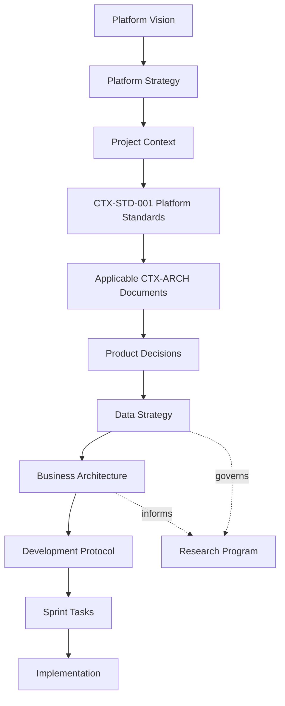

# CreteXchange Documentation Library

This is the official, canonical entry point for all CreteXchange project documentation. Developers, contributors, AI assistants, and automation MUST begin here before making an architectural, operational, or implementation decision.

## Project Overview

CreteXchange is a trusted construction-materials operations platform. Its current foundation supports practical Driver, participating Facility, and Platform Operations workflows around verified operational activity. Its long-term mission is the Construction Circular Economy Intelligence Platform: helping the ecosystem discover, verify, recover, reuse, measure, and improve construction-material movement.

Current implementation, approved scope, and future strategy must remain distinct. No documentation or implementation may represent a future capability as current merely because it appears on a roadmap.

## Documentation Hierarchy

For project and implementation decisions, use this reading order:

1. [Documentation Library](./README.md)
2. [Project Context](./project/project-context.md)
3. [CTX-STD-001 — CreteXchange Platform Standards](./standards/cretexchange-platform-standards.md)
4. [CTX-GOV-001 — Documentation Governance Standard](./standards/CTX-GOV-001-documentation-governance-standard.md) (Approved)
5. Applicable [CTX-ARCH documents](./architecture/README.md)
6. [Product Decisions](./product/product-decisions.md)
7. [Development Protocol](./development-protocol.md)
8. [CTX-DEP-001 — Production Deployment Protocol](./standards/CTX-DEP-001-production-deployment-protocol.md)
9. [CTX-OPS-001 — Production Release Checklist](./operations/CTX-OPS-001-production-release-checklist.md)
10. [CTX-OPS-002 — Administration Operations Guide](./operations/CTX-OPS-002-administration-operations-guide.md)

Earlier documents take precedence when guidance conflicts. Vision, strategy, UX specifications, runbooks, sprint plans, tests, and implementation code provide essential context within their domains, but they must not override this hierarchy.

## Where to Start

1. Follow the [Documentation Hierarchy](#documentation-hierarchy) above.
2. Read [Platform Vision](./vision/platform-vision.md) and [Platform Strategy](./vision/platform-strategy.md) for enduring mission and long-term direction.
3. Read the applicable UX specification, runbook, and sprint document for the feature area.
4. For a production release, read [CTX-DEP-001](./standards/CTX-DEP-001-production-deployment-protocol.md) and complete [CTX-OPS-001](./operations/CTX-OPS-001-production-release-checklist.md).
5. Identify the canonical source of truth before implementation. If it is unclear, audit first.

This README is a navigation and governance guide. It does not replace the authorities it links to.

The platform follows:

- Architecture First
- Standards First
- Configuration Before Code
- Financially Conservative Accounting
- Single Source of Truth

## Documentation Authority

The hierarchy above governs current project and implementation decisions. The following durable sources add strategic and business context:

1. `docs/vision/platform-vision.md`
2. `docs/vision/platform-strategy.md`
3. `docs/project/project-context.md`
4. `docs/standards/cretexchange-platform-standards.md` (`CTX-STD-001`)
5. `CTX-ARCH` documents
6. `docs/product/product-decisions.md`
7. `docs/product/data-strategy.md`
8. `docs/business/business-model.md` and related business documents
9. `docs/development-protocol.md`

Supporting, historical, or archived documents must not override this hierarchy.

For day-to-day implementation, the operational reading sequence begins with Project Context and the Development Protocol after Vision and Strategy have established the governing direction. Lower-level artifacts—UX specifications, roadmaps, runbooks, sprint plans, tests, and implementation code—must not contradict higher-level authorities.

Platform Vision defines why CreteXchange exists. Platform Strategy defines the authoritative long-term strategic roadmap. Project Context defines the current implementation and approved delivery context. Strategy does not supersede implementation architecture or authorize sprint work.

Business documents guide customer-value, business-model, and monetization decisions. They do not override Platform Standards, CTX-ARCH documents, implemented business rules, or approved sprint scope.

Research documents define proposed hypotheses, validation plans, grant readiness, and study governance. They are supporting documents governed by this hierarchy and do not constitute implemented capabilities, scientific results, funding commitments, or sprint authorization.

## Documentation Overview

| Area | Purpose |
| --- | --- |
| Project | Current scope, active delivery context, pilot baseline, and roadmap. |
| Product | Durable product policy, operational rules, and decision records. |
| Standards | Mandatory engineering and platform controls, including CTX-STD-001 and CTX-DEP-001. |
| Architecture | Technical source-of-truth boundaries and implementation contracts. |
| Development Protocol | Required preflight, validation, Git, and implementation workflow. |
| Deployment | Mandatory production-release controls in CTX-DEP-001. |
| Operations | The required production-release checklist and durable release record in CTX-OPS-001, the Draft Administration Operations Guide in CTX-OPS-002, and governed operational runbooks. |

## Documentation Navigation

- [Platform Vision](./vision/platform-vision.md)
  - [Mission and Values](./vision/mission-and-values.md)
  - [Long-Term Roadmap](./vision/long-term-roadmap.md)
  - [Construction Circular Economy Intelligence Platform](./vision/construction-circular-economy-intelligence-platform.md)
- [Platform Strategy](./vision/platform-strategy.md)
- [Project Context](./project/project-context.md)
  - [Sprint Roadmap](./project/sprint-roadmap.md)
  - [Epic Roadmap](./project/epic-roadmap.md)
  - [Sprint 2.1](./project/sprints/sprint-2.1.md)
  - [Sprint 2.1.4 — Admin Intelligence Foundation / Platform Operations Center](./project/sprints/sprint-2.1.4.md)
  - [Sprint 2.2 — MVP Operational Readiness](./project/sprints/sprint-2.2.md)
  - [PB-001 — CreteXchange Pilot Baseline v1.0](./project/pilot/PB-001-cretexchange-pilot-baseline-v1.0.md)
- [Platform Standards](./standards/cretexchange-platform-standards.md)
  - [CTX-DEP-001 - Production Deployment Protocol](./standards/CTX-DEP-001-production-deployment-protocol.md)
- Production Operations
  - [CTX-OPS-001 - Production Release Checklist](./operations/CTX-OPS-001-production-release-checklist.md)
  - [CTX-OPS-002 - Administration Operations Guide](./operations/CTX-OPS-002-administration-operations-guide.md) — Draft; current administrative operating boundaries and documentation gaps.
  - [Operations Runbook Framework](./operations/README.md)
  - [CTX-RB-003 - Incident Response Runbook](./operations/CTX-RB-003-incident-response-runbook.md) — Draft; evidence and escalation only.
  - [CTX-RB-004 - Database Recovery Runbook](./operations/CTX-RB-004-database-recovery-runbook.md) — Draft; recovery evidence and decision boundaries only.
  - [CTX-RB-005 - Financial Reconciliation Runbook](./operations/CTX-RB-005-financial-reconciliation-runbook.md) — Draft; non-executing financial review only.
  - [CTX-RB-006 - Driver Verification Runbook](./operations/CTX-RB-006-driver-verification-runbook.md) — Draft; evidence-based verification and escalation only.
  - [CTX-RB-007 - Administrative Photo Review Runbook](./operations/CTX-RB-007-administrative-photo-review-runbook.md) — Draft; factual activity-evidence review and escalation boundaries.
  - [CTX-RB-008 - Marketplace Trust & Fraud Escalation Runbook](./operations/CTX-RB-008-marketplace-trust-and-fraud-escalation-runbook.md) — Draft; neutral trust escalation and evidence preservation only.
  - [CTX-RB-009 - Daily Operations Checklist](./operations/CTX-RB-009-daily-operations-checklist.md) — Draft; daily read-only operational review and escalation boundaries.
- [Architecture Library](./architecture/README.md)
- [Product Decisions](./product/product-decisions.md)
- [Product Data Strategy](./product/data-strategy.md)
- [Business Architecture](./business/README.md)
  - [Business Model](./business/business-model.md)
  - [Revenue Architecture](./business/revenue-architecture.md)
  - [Customer Value Framework](./business/customer-value-framework.md)
  - [Platform Flywheel](./business/platform-flywheel.md)
  - [Investment Thesis](./business/investment-thesis.md)
  - [Market Analysis](./business/market-analysis.md)
  - [Competitor Analysis](./business/competitor-analysis.md)
  - [Five-Year Strategy](./business/five-year-strategy.md)
- [Research Program](./research/README.md)
  - [Grant-Readiness Roadmap](./research/grant-readiness-roadmap.md)
  - [NSF Project Pitch](./research/nsf-project-pitch.md)
  - [NSF Phase I Research Plan](./research/nsf-phase1-research-plan.md)
  - [Commercialization Strategy](./research/commercialization-strategy.md)
  - [Environmental Impact Framework](./research/environmental-impact-framework.md)
  - [Platform Economics](./research/platform-economics.md)
  - [Funding Opportunities](./research/funding-opportunities.md)
  - [Research Roadmap](./research/research-roadmap.md)
  - [Advisory Board Plan](./research/advisory-board-plan.md)
- [Development Protocol](./development-protocol.md)

## Documentation Families

| Family | Purpose | Audience | When to update | Examples |
| --- | --- | --- | --- | --- |
| Project Context | Current implementation state, active scope, and delivery context | All contributors | When current phase, implementation context, or approved sprint context changes | [Project Context](./project/project-context.md) |
| Development Protocol | Required execution, preflight, source-of-truth, and validation workflow | Contributors and Codex | When the engineering workflow or validation policy changes | [Development Protocol](./development-protocol.md), [New Chat Kickoff](./project/new-chat-kickoff.md) |
| CTX-STD | Mandatory platform engineering standards | Engineering and reviewers | When a durable engineering standard changes | [CTX-STD-001](./standards/cretexchange-platform-standards.md) |
| CTX-GOV | Documentation governance and library-wide authoring controls | Documentation and Operations Governance, contributors, and reviewers | When documentation governance, authority, lifecycle, or library controls change | [CTX-GOV-001](./standards/CTX-GOV-001-documentation-governance-standard.md) |
| CTX-POL | Governance policies for operational, privacy, access, and related control boundaries | Policy owner, Operations, and reviewers | Annual and event-driven when the governed control changes | [CTX-POL-003](./standards/CTX-POL-003-data-retention-policy.md), [CTX-POL-004](./standards/CTX-POL-004-incident-response-policy.md), [CTX-POL-008](./standards/CTX-POL-008-access-control-policy.md) |
| Production Release Governance | Mandatory protocol and operational record for every production deployment | Release operators, approvers, Platform Operations, and engineering | When release controls or required production evidence change | [CTX-DEP-001](./standards/CTX-DEP-001-production-deployment-protocol.md), [CTX-OPS-001](./operations/CTX-OPS-001-production-release-checklist.md) |
| CTX-ARCH | Implementation architecture, source-of-truth boundaries, and domain contracts | Engineering, architecture, and reviewers | Before or with an approved architecture change | [Architecture Library](./architecture/README.md) |
| PD | Durable product policy and operational rules | Product, Operations, Engineering | When a product-policy decision is made or revised | [Product Decisions](./product/product-decisions.md), [PD-050](./product/PD-050-facility-operational-access-and-billing-readiness.md) |
| CTX-UX | Experience architecture for future interfaces | Product, Design, Engineering, Operations | Before a material experience enhancement or when a durable UX contract changes | [CTX-UX-005](./ux/CTX-UX-005-driver-dashboard-experience.md) |
| Runbooks | Authorized operational support and recovery guidance | Platform Operations and pilot support | When approved procedures, ownership, or escalation paths change | [Assisted-Pilot Operations Runbook](./project/pilot/assisted-pilot-operations-runbook.md) |
| Roadmaps | Directional sequencing and milestone context | Product and planning | When priorities or completed phases change | [Sprint Roadmap](./project/sprint-roadmap.md), [Epic Roadmap](./project/epic-roadmap.md) |
| Sprint Plans | Approved delivery objectives, phases, scope, and validation | Delivery teams | At sprint start, transition, and closeout | [Sprint 2.2](./project/sprints/sprint-2.2.md) |
| Testing | Executable behavioral evidence for implementation | Engineering and reviewers | With behavior changes or test-harness maintenance | `tests/`, focused feature tests, validation recorded by the Development Protocol |

Before implementation, documentation should exist for the governing product policy and architecture. Create or update a UX specification when the change establishes a durable experience contract. Do not use a roadmap, runbook, test, or code path to override an applicable standard, architecture document, or Product Decision.

## Current UX Architecture

| UX specification | Current purpose |
| --- | --- |
| [CTX-UX-001](./ux/CTX-UX-001-first-impression-and-onboarding-experience.md) | Defines the first impression and foundational onboarding experience. |
| [CTX-UX-002](./ux/CTX-UX-002-landing-page-content-information-architecture-and-wireframe-specification.md) | Defines public landing-page content, information architecture, and wireframe direction. |
| [CTX-UX-003](./ux/CTX-UX-003-first-time-user-journey-and-pilot-readiness.md) | Defines first-time journeys, pilot readiness, friction mapping, and TFVA boundaries. |
| [CTX-UX-004](./ux/CTX-UX-004-first-time-user-onboarding-experience.md) | Defines detailed Driver and Facility onboarding through first verified activity. |
| [CTX-UX-005](./ux/CTX-UX-005-driver-dashboard-experience.md) | Defines the Driver Dashboard as an operational command center and next-action experience. |
| [CTX-UX-006](./ux/CTX-UX-006-facility-workspace-experience.md) | Defines the Facility Workspace for location management, fair Driver review, and operational readiness. |
| [CTX-UX-007](./ux/CTX-UX-007-platform-operations-center-experience.md) | Defines the overall Platform Operations Center workspace for marketplace health, queues, alerts, and support. |
| [CTX-UX-008](./ux/CTX-UX-008-administrative-activity-review-experience.md) | Defines the dedicated administrative activity-investigation experience under PD-052. |

## Active Product Decisions

Product Decisions define durable business policy and operational rules. They do not implement a feature by themselves.

| Decision | Policy summary |
| --- | --- |
| [PD-050](./product/PD-050-facility-operational-access-and-billing-readiness.md) | Separates Facility operational authorization from financial readiness; a payment method is not an operational location-management prerequisite. |
| [PD-051](./product/PD-051-driver-activity-and-payment-lifecycle.md) | Separates operational activity verification from payment, wallet, schedule, and settlement presentation. |
| [PD-052](./product/PD-052-marketplace-trust-administrative-activity-review-and-dispute-resolution.md) | Governs evidence-based, neutral, least-privilege administrative review and marketplace-trust policy. |
| [PD-053](./product/PD-053-canonical-financial-batch-lifecycle-and-approval-policy.md) | Governs canonical weekly financial-batch review, approval, exceptions, and Phase 3B non-execution. |

## Archived References

- [Archived Governance Documents](./archive/governance/README.md)
- [Archived Product References](./archive/product/README.md)

## Documentation Structure

CreteXchange documentation is organized into durable, decision-oriented sections:

- Vision and Strategy
- Project Context and Sprint Scope
- Architecture Documents
- Standards Documents
- Production Release Governance
- Product Decisions
- Data Strategy
- Business Architecture
- Research and Grant Readiness
- Architecture Decision Records (ADRs)
- Future Design Documents

## Architecture Library

| Document ID | Title | Purpose | Current Status |
| --- | --- | --- | --- |
| CTX-ARCH-001 | Financial Architecture & KPI Specification | Authoritative financial lifecycle, billing, receivables, wallet, Stripe/payment lifecycle, and KPI source of truth. | Approved |
| CTX-ARCH-002 | Owner Operations Architecture | Defines owner-facing operational workflows, location configuration, and owner KPI behavior. | Approved |
| CTX-ARCH-003 | Driver Operations Architecture | Defines driver workflows, location discovery, activity lifecycle, wallet visibility, and driver KPI behavior. | Approved |
| CTX-ARCH-004 | Admin Operations Architecture | Defines admin oversight, support, reconciliation, platform configuration, and administrative governance. | Approved |
| CTX-ARCH-005 | Material Management Architecture | Defines material taxonomy, financial direction, settlement models, pricing, capacity, and extensibility. | Approved |
| CTX-ARCH-006 | Driver Incentive and Financial Settlement Architecture | Defines the immutable incentive snapshot, owner charge, payment obligation, wallet-authoritative settlement, Stripe payout, idempotency, recovery, and financial reporting contract. | Approved; PD-045 Active; runtime remediation pending |
| CTX-ARCH-007 | [Canonical Financial Batch Architecture](./architecture/CTX-ARCH-007-canonical-financial-batch-architecture.md) | Defines canonical batch identity, frozen membership/totals, audit, discovery queues, legacy isolation, and Phase 3B non-execution. | Approved architecture direction; implementation pending |
| CTX-ARCH-011 | [Administration Repository Documentation Refresh Design](./architecture/CTX-ARCH-011-administration-repository-documentation-refresh-design.md) | Defines the proposed controlled refresh of derived documentation inventory while preserving Git authority. | Draft; implementation not authorized |

## Standards Library

| Document ID | Title | Purpose |
| --- | --- | --- |
| CTX-STD-001 | CreteXchange Platform Standards | Defines mandatory engineering and development standards governing the platform. |
| CTX-STD-002 | [Documentation Governance, Metadata, Lifecycle, Authority, and Relationship Standard](./standards/CTX-STD-002-documentation-governance-metadata-lifecycle-authority-and-relationships.md) | Approved detailed metadata, lifecycle, classification, authority, and relationship model for governed documentation. |
| CTX-DB-001 | [Database Migration and Schema Governance Standard](./standards/CTX-DB-001-database-migration-and-schema-governance-standard.md) | Defines the documentation and governance requirements for controlled database migration and schema change. |
| CTX-GOV-001 | [Documentation Governance Standard](./standards/CTX-GOV-001-documentation-governance-standard.md) | Approved library-wide standard for documentation authority, lifecycle, metadata, relationships, and authoring practice. |
| CTX-GOV-002 | [Documentation Program Health Assessment](./standards/CTX-GOV-002-documentation-program-health-assessment.md) | Draft non-governing assessment of library health, discovery, integrity, and refresh gaps. |
| CTX-POL-003 | [Data Retention Policy](./standards/CTX-POL-003-data-retention-policy.md) | Draft retention, preservation, archival, and disposal governance without asserted retention periods. |
| CTX-POL-004 | [Incident Response Policy](./standards/CTX-POL-004-incident-response-policy.md) | Draft incident-management authority, evidence, communication, and review governance. |
| CTX-POL-008 | [Access Control Policy](./standards/CTX-POL-008-access-control-policy.md) | Draft least-privilege, authorization, production-access, and financial-authority-separation governance. |
| CTX-DEP-001 | [Production Deployment Protocol](./standards/CTX-DEP-001-production-deployment-protocol.md) | Defines mandatory controls for source verification, migration discovery and execution, schema verification, deployment, health, smoke testing, reporting, and rollback. |
| CTX-OPS-001 | [Production Release Checklist](./operations/CTX-OPS-001-production-release-checklist.md) | Provides the required operational checklist and durable release record for every production deployment. |
| CTX-OPS-002 | [Administration Operations Guide](./operations/CTX-OPS-002-administration-operations-guide.md) | Draft guide for safe, truthful operation of currently supported administrative capabilities and their boundaries. |
| CTX-RB-009 | [Daily Operations Checklist](./operations/CTX-RB-009-daily-operations-checklist.md) | Draft daily checklist for authorized operational review, evidence preservation, and escalation without execution. |
| CTX-RB-003 | [Incident Response Runbook](./operations/CTX-RB-003-incident-response-runbook.md) | Draft response, evidence-preservation, and escalation procedure without recovery or production-change authority. |
| CTX-RB-004 | [Database Recovery Runbook](./operations/CTX-RB-004-database-recovery-runbook.md) | Draft recovery evidence and decision boundaries; no provider-specific recovery procedure is asserted. |
| CTX-RB-005 | [Financial Reconciliation Runbook](./operations/CTX-RB-005-financial-reconciliation-runbook.md) | Draft non-executing financial-consistency review and escalation procedure. |
| CTX-RB-006 | [Driver Verification Runbook](./operations/CTX-RB-006-driver-verification-runbook.md) | Draft evidence-based driver-verification and escalation procedure without account-restriction or financial-execution authority. |
| CTX-RB-007 | [Administrative Photo Review Runbook](./operations/CTX-RB-007-administrative-photo-review-runbook.md) | Draft factual activity-evidence review procedure with authorization and escalation boundaries. |
| CTX-RB-008 | [Marketplace Trust & Fraud Escalation Runbook](./operations/CTX-RB-008-marketplace-trust-and-fraud-escalation-runbook.md) | Draft neutral trust escalation and evidence-preservation procedure; it does not establish fraud-investigation or provider-action authority. |

### Supporting architecture records

- [CTX-ARCH-008-APPROVAL-RECORD — Architecture Approval Record](./architecture/approvals/CTX-ARCH-008-architecture-approval-record.md)
- [CTX-ARCH-008-VERIFICATION — Railway Platform and Database Recovery Verification](./architecture/verification/CTX-ARCH-008-railway-platform-and-database-recovery-verification.md)
- [CTX-ARCH-009-REVIEW — Operations Library and Knowledge Management Architecture Review](./architecture/reviews/CTX-ARCH-009-architecture-review.md)

## Governance Documents

- [CTX-DEP-001 — Production Deployment Protocol](./standards/CTX-DEP-001-production-deployment-protocol.md): mandatory production source, migration, environment, validation, health, smoke-test, financial-safety, rollback, and completion controls.
- [CTX-GOV-001 — Documentation Governance Standard](./standards/CTX-GOV-001-documentation-governance-standard.md): Approved documentation-governance standard; it does not replace applicable platform, architecture, product, development, operations, or release authorities, and does not itself authorize an application release, implementation, deployment, or production adoption.
- [CTX-POL-003 — Data Retention Policy](./standards/CTX-POL-003-data-retention-policy.md), [CTX-POL-004 — Incident Response Policy](./standards/CTX-POL-004-incident-response-policy.md), and [CTX-POL-008 — Access Control Policy](./standards/CTX-POL-008-access-control-policy.md): Draft Operational Governance Policy Package; policies establish governance and do not replace runbook procedures.
- [CTX-OPS-001 — Production Release Checklist](./operations/CTX-OPS-001-production-release-checklist.md): the operational checklist and evidence record required to demonstrate a complete production release.
- [CTX-OPS-002 — Administration Operations Guide](./operations/CTX-OPS-002-administration-operations-guide.md): Draft guidance for authorized administration and Platform Operations; it does not replace CTX-OPS-001 or authorize production change.
- [CTX-RB-009 — Daily Operations Checklist](./operations/CTX-RB-009-daily-operations-checklist.md): Draft recurring review procedure governed by the Operations Runbook Framework; it does not authorize production change or financial execution.
- [CTX-RB-003 — Incident Response Runbook](./operations/CTX-RB-003-incident-response-runbook.md), [CTX-RB-004 — Database Recovery Runbook](./operations/CTX-RB-004-database-recovery-runbook.md), and [CTX-RB-005 — Financial Reconciliation Runbook](./operations/CTX-RB-005-financial-reconciliation-runbook.md): Draft Operational Resilience Package; none authorizes production change, provider action, or financial execution.
- [CTX-RB-006 — Driver Verification Runbook](./operations/CTX-RB-006-driver-verification-runbook.md), [CTX-RB-007 — Administrative Photo Review Runbook](./operations/CTX-RB-007-administrative-photo-review-runbook.md), and [CTX-RB-008 — Marketplace Trust & Fraud Escalation Runbook](./operations/CTX-RB-008-marketplace-trust-and-fraud-escalation-runbook.md): Draft marketplace-operations procedures for evidence review and escalation; none authorizes account restriction, provider action, or financial execution.

## Product Decisions

Product Decisions document business direction and governance.

Reference:

- `docs/product/product-decisions.md`

## Architecture Decision Records

ADRs capture technical decisions that guide implementation. They record the rationale behind important architecture choices and provide durable context for future development.

## Development Workflow

Follow the [Development Protocol](./development-protocol.md) for every change. The normal delivery sequence is:

```text
Research
↓
Architecture / Product Decision (if needed)
↓
UX Specification (if needed)
↓
Implementation
↓
Focused Validation
↓
Narrow Audit
↓
Small Commit
↓
Push
↓
Deployment
```

Not every task needs every artifact: a small implementation within established policy may not need new research, architecture, or UX documentation. A material new policy, source-of-truth boundary, or participant experience should be documented before code is changed. Preserve working-tree integrity throughout: inspect existing changes, avoid broad cleanup, and do not mix unrelated work into a feature commit.

## Validation Levels

The [Development Protocol](./development-protocol.md#risk-based-validation-policy) defines the required validation level.

| Level | Appropriate for | Expected validation |
| --- | --- | --- |
| Level 1 | Documentation, copy, isolated styling, or low-risk local changes | Inspection, relevant targeted checks, links/whitespace where applicable, and diff review. |
| Level 2 | A feature-area change such as Driver, Facility, or Platform Operations experience work | Targeted inspection, focused tests, type validation where relevant, manual walkthrough, and one build after the batch. |
| Level 3 | Security, privacy, authorization, payments, wallets, settlement, schemas, migrations, or shared storage | Full typecheck and build, focused high-risk tests, and full-suite checkpoint where executable. |

Apply the least expensive validation that provides responsible confidence. Explicit release, security, financial, migration, or deployment requirements may raise the level.

## Branching and Commit Philosophy

- Keep commits small and limited to one concern.
- Stage only approved files and approved hunks; use selective staging for mixed files.
- Do not stage unrelated working-tree changes, formatting churn, generated output, or another feature’s cleanup.
- Use a clean worktree when required work cannot be safely separated from unrelated hunks.
- Run a narrow pre-commit audit against the staged patch.
- Push only after the intended patch and validation results are confirmed.

This preserves reviewability, rollback safety, and the integrity of shared worktrees.

## Documentation Maintenance

Documentation changes MUST accompany material architecture, process, lifecycle, authorization, or release-governance changes. The applicable Project Context, standards, architecture documents, Product Decisions, runbooks, and implementation must remain synchronized. Update this index whenever an authoritative documentation family or navigation path changes.

## Pilot Philosophy

CreteXchange pilot work follows these operating principles:

- **Operational truth:** describe the current operational state accurately.
- **Financial separation:** verification, configured incentives, wallet information, payments, and settlement retain distinct meanings.
- **Evidence-based review:** review activity fairly from authorized evidence and recorded workflow context.
- **Marketplace trust:** protect Drivers, participating Facilities, and marketplace integrity through transparent, proportionate operations.
- **Driver-first:** reduce field friction and Time to First Verified Activity without bypassing evidence or eligibility.
- **Facility fairness:** separate Facility operational access from financial readiness and support timely, impartial review.
- **Platform neutrality:** Platform Operations acts under authorized policy rather than favoring a participant.

## Future Roadmap

Near-term implementation should follow approved sprint scope and the applicable UX specifications. Major experience areas include:

- Driver Dashboard — [CTX-UX-005](./ux/CTX-UX-005-driver-dashboard-experience.md)
- Facility Workspace — [CTX-UX-006](./ux/CTX-UX-006-facility-workspace-experience.md)
- Platform Operations Center — [CTX-UX-007](./ux/CTX-UX-007-platform-operations-center-experience.md)
- Administrative Activity Review — [CTX-UX-008](./ux/CTX-UX-008-administrative-activity-review-experience.md)
- Marketplace Trust — [PD-052](./product/PD-052-marketplace-trust-administrative-activity-review-and-dispute-resolution.md)
- Pilot completion and operational readiness — [Sprint 2.2](./project/sprints/sprint-2.2.md)

These documents guide planning; they do not independently authorize implementation or expand current sprint scope.

## Quick Reference

| If you need to… | Read… |
| --- | --- |
| Understand current project state or active delivery scope | [Project Context](./project/project-context.md) |
| Plan or implement a change | [Development Protocol](./development-protocol.md) and the applicable architecture document |
| Change the Driver Dashboard | [CTX-UX-005](./ux/CTX-UX-005-driver-dashboard-experience.md) and [CTX-ARCH-003](./architecture/driver-operations-architecture.md) |
| Change participating Facility approval or operational location access | [PD-050](./product/PD-050-facility-operational-access-and-billing-readiness.md) and [CTX-UX-006](./ux/CTX-UX-006-facility-workspace-experience.md) |
| Change activity, payment, wallet, or settlement presentation | [PD-051](./product/PD-051-driver-activity-and-payment-lifecycle.md) and [CTX-ARCH-006](./architecture/driver-incentive-and-financial-settlement-architecture.md) |
| Change canonical financial batches | [CTX-ARCH-007](./architecture/CTX-ARCH-007-canonical-financial-batch-architecture.md) and [PD-053](./product/PD-053-canonical-financial-batch-lifecycle-and-approval-policy.md) |
| Review financial pilot readiness | [PB-001](./project/pilot/PB-001-cretexchange-pilot-baseline-v1.0.md) |
| Change Platform Operations financial queues | [CTX-UX-007](./ux/CTX-UX-007-platform-operations-center-experience.md) and [CTX-ARCH-007](./architecture/CTX-ARCH-007-canonical-financial-batch-architecture.md) |
| Change marketplace trust or administrative-review policy | [PD-052](./product/PD-052-marketplace-trust-administrative-activity-review-and-dispute-resolution.md) |
| Review evidence or plan a dedicated investigation experience | [CTX-UX-008](./ux/CTX-UX-008-administrative-activity-review-experience.md) |
| Change Platform Operations workspace behavior | [CTX-UX-007](./ux/CTX-UX-007-platform-operations-center-experience.md) |
| Understand sprint or milestone sequencing | [Sprint Roadmap](./project/sprint-roadmap.md) and [Epic Roadmap](./project/epic-roadmap.md) |

## Current financial-processing sequence

Phase 1 keeps Facility verification operational-only. Phase 2 creates canonical pending obligations without execution. Phase 3A disables legacy financial execution. [CTX-ARCH-007](./architecture/CTX-ARCH-007-canonical-financial-batch-architecture.md) and [PD-053](./product/PD-053-canonical-financial-batch-lifecycle-and-approval-policy.md) define the pending non-executing Phase 3B batch-governance boundary. Payment-enabled testing remains blocked until later approved architecture, migration, reconciliation, and pilot-baseline gates are complete.

## Guiding Principles

- Operational-first
- Truth before convenience
- Marketplace trust
- Evidence over assumption
- Least privilege
- Accessibility
- Bilingual readiness
- Incremental delivery
- Small, auditable changes

## Documentation Dependency Diagram


