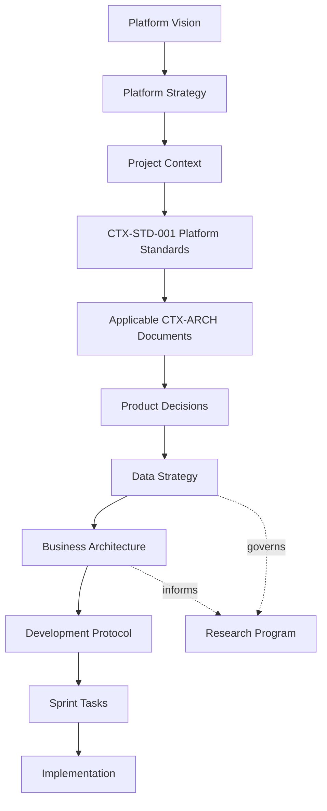

# CreteXchange Documentation Library

This is the primary landing page for CreteXchange documentation. Read this first before making changes to the platform.

The platform follows:

- Architecture First
- Standards First
- Configuration Before Code
- Financially Conservative Accounting
- Single Source of Truth

## Documentation Authority

The canonical documentation order of precedence is:

1. `docs/vision/platform-vision.md`
2. `docs/vision/platform-strategy.md`
3. `docs/project/project-context.md`
4. `docs/standards/cretexchange-platform-standards.md` (`CTX-STD-001`)
5. `CTX-ARCH` documents
6. `docs/product/product-decisions.md`
7. `docs/product/data-strategy.md`
8. `docs/business/business-model.md` and related business documents
9. `docs/development-protocol.md`

Supporting, historical, or archived documents must not override this hierarchy.

Platform Vision defines why CreteXchange exists. Platform Strategy defines the authoritative long-term strategic roadmap. Project Context defines the current implementation and approved delivery context. Strategy does not supersede implementation architecture or authorize sprint work.

Business documents guide customer-value, business-model, and monetization decisions. They do not override Platform Standards, CTX-ARCH documents, implemented business rules, or approved sprint scope.

Research documents define proposed hypotheses, validation plans, grant readiness, and study governance. They are supporting documents governed by this hierarchy and do not constitute implemented capabilities, scientific results, funding commitments, or sprint authorization.

## Documentation Navigation

- [Platform Vision](./vision/platform-vision.md)
  - [Mission and Values](./vision/mission-and-values.md)
  - [Long-Term Roadmap](./vision/long-term-roadmap.md)
  - [Construction Circular Economy Intelligence Platform](./vision/construction-circular-economy-intelligence-platform.md)
- [Platform Strategy](./vision/platform-strategy.md)
- [Project Context](./project/project-context.md)
- [Platform Standards](./standards/cretexchange-platform-standards.md)
- [Architecture Library](./architecture/README.md)
- [Product Decisions](./product/product-decisions.md)
- [Product Data Strategy](./product/data-strategy.md)
- [Business Architecture](./business/README.md)
  - [Business Model](./business/business-model.md)
  - [Revenue Architecture](./business/revenue-architecture.md)
  - [Customer Value Framework](./business/customer-value-framework.md)
  - [Platform Flywheel](./business/platform-flywheel.md)
  - [Investment Thesis](./business/investment-thesis.md)
  - [Market Analysis](./business/market-analysis.md)
  - [Competitor Analysis](./business/competitor-analysis.md)
  - [Five-Year Strategy](./business/five-year-strategy.md)
- [Research Program](./research/README.md)
  - [Grant-Readiness Roadmap](./research/grant-readiness-roadmap.md)
  - [NSF Project Pitch](./research/nsf-project-pitch.md)
  - [NSF Phase I Research Plan](./research/nsf-phase1-research-plan.md)
  - [Commercialization Strategy](./research/commercialization-strategy.md)
  - [Environmental Impact Framework](./research/environmental-impact-framework.md)
  - [Platform Economics](./research/platform-economics.md)
  - [Funding Opportunities](./research/funding-opportunities.md)
  - [Research Roadmap](./research/research-roadmap.md)
  - [Advisory Board Plan](./research/advisory-board-plan.md)
- [Development Protocol](./development-protocol.md)

## Archived References

- [Archived Governance Documents](./archive/governance/README.md)
- [Archived Product References](./archive/product/README.md)

## Documentation Structure

CreteXchange documentation is organized into durable, decision-oriented sections:

- Vision and Strategy
- Project Context and Sprint Scope
- Architecture Documents
- Standards Documents
- Product Decisions
- Data Strategy
- Business Architecture
- Research and Grant Readiness
- Architecture Decision Records (ADRs)
- Future Design Documents

## Architecture Library

| Document ID | Title | Purpose | Current Status |
| --- | --- | --- | --- |
| CTX-ARCH-001 | Financial Architecture & KPI Specification | Authoritative financial lifecycle, billing, receivables, wallet, Stripe/payment lifecycle, and KPI source of truth. | Approved |
| CTX-ARCH-002 | Owner Operations Architecture | Defines owner-facing operational workflows, location configuration, and owner KPI behavior. | Approved |
| CTX-ARCH-003 | Driver Operations Architecture | Defines driver workflows, location discovery, activity lifecycle, wallet visibility, and driver KPI behavior. | Approved |
| CTX-ARCH-004 | Admin Operations Architecture | Defines admin oversight, support, reconciliation, platform configuration, and administrative governance. | Approved |
| CTX-ARCH-005 | Material Management Architecture | Defines material taxonomy, financial direction, settlement models, pricing, capacity, and extensibility. | Approved |

## Standards Library

| Document ID | Title | Purpose |
| --- | --- | --- |
| CTX-STD-001 | CreteXchange Platform Standards | Defines mandatory engineering and development standards governing the platform. |

## Product Decisions

Product Decisions document business direction and governance.

Reference:

- `docs/product/product-decisions.md`

## Architecture Decision Records

ADRs capture technical decisions that guide implementation. They record the rationale behind important architecture choices and provide durable context for future development.

## Documentation Dependency Diagram

