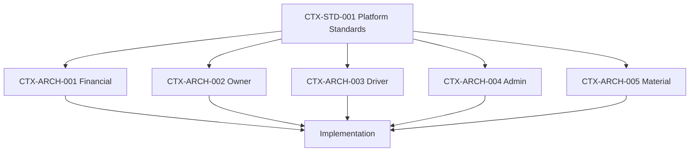

# CreteXchange Documentation Library

This is the primary landing page for CreteXchange documentation. Read this first before making changes to the platform.

The platform follows:

- Architecture First
- Standards First
- Configuration Before Code
- Financially Conservative Accounting
- Single Source of Truth

## Documentation Authority

The canonical documentation order of precedence is:

1. `docs/vision/platform-vision.md`
2. `docs/project/project-context.md`
3. `docs/standards/cretexchange-platform-standards.md` (`CTX-STD-001`)
4. `CTX-ARCH` documents
5. `docs/product/product-decisions.md`
6. `docs/product/data-strategy.md`
7. `docs/development-protocol.md`

Supporting, historical, or archived documents must not override this hierarchy.

## Documentation Navigation

- [Platform Vision](./vision/platform-vision.md)
- [Project Context](./project/project-context.md)
- [Product Data Strategy](./product/data-strategy.md)
- [Development Protocol](./development-protocol.md)

## Archived References

- [Archived Governance Documents](./archive/governance/README.md)
- [Archived Product References](./archive/product/README.md)

## Documentation Structure

CreteXchange documentation is organized into durable, decision-oriented sections:

- Architecture Documents
- Standards Documents
- Product Decisions
- Architecture Decision Records (ADRs)
- Future Design Documents

## Architecture Library

| Document ID | Title | Purpose | Current Status |
| --- | --- | --- | --- |
| CTX-ARCH-001 | Financial Architecture & KPI Specification | Authoritative financial lifecycle, billing, receivables, wallet, Stripe/payment lifecycle, and KPI source of truth. | Approved |
| CTX-ARCH-002 | Owner Operations Architecture | Defines owner-facing operational workflows, location configuration, and owner KPI behavior. | Approved |
| CTX-ARCH-003 | Driver Operations Architecture | Defines driver workflows, location discovery, activity lifecycle, wallet visibility, and driver KPI behavior. | Approved |
| CTX-ARCH-004 | Admin Operations Architecture | Defines admin oversight, support, reconciliation, platform configuration, and administrative governance. | Approved |
| CTX-ARCH-005 | Material Management Architecture | Defines material taxonomy, financial direction, settlement models, pricing, capacity, and extensibility. | Approved |

## Standards Library

| Document ID | Title | Purpose |
| --- | --- | --- |
| CTX-STD-001 | CreteXchange Platform Standards | Defines mandatory engineering and development standards governing the platform. |

## Product Decisions

Product Decisions document business direction and governance.

Reference:

- `docs/product/product-decisions.md`

## Architecture Decision Records

ADRs capture technical decisions that guide implementation. They record the rationale behind important architecture choices and provide durable context for future development.

## Documentation Dependency Diagram

