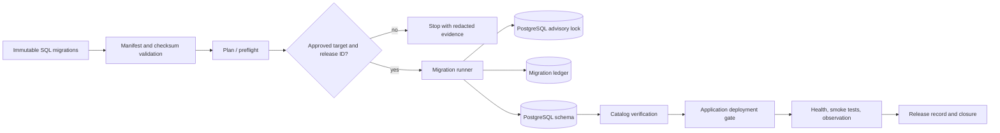

# CTX-ARCH-008 — Production Database Migration Architecture

- **Document owner:** V8 Laboratories
- **Status:** **DRAFT — NOT YET APPROVED FOR IMPLEMENTATION**
- **Version:** 0.1
- **Date:** July 22, 2026
- **Intended approvers:** Architecture governance owner, release authority, security/operations owner, and business/technical approver
- **Supersedes:** None
- **Superseded by:** None
- **Related standards:** [CTX-STD-001](../standards/cretexchange-platform-standards.md), [CTX-DB-001](../standards/CTX-DB-001-database-migration-and-schema-governance-standard.md), [CTX-DEP-001](../standards/CTX-DEP-001-production-deployment-protocol.md), and [CTX-OPS-001](../operations/CTX-OPS-001-production-release-checklist.md)
- **Related architecture:** [CTX-ARCH-007](./CTX-ARCH-007-canonical-financial-batch-architecture.md)
- **Related evidence:** [Phase B discovery and requirements](./production-database-migration-discovery-and-requirements.md) and the [closed 0027/0029 release record](../operations/migration-releases/2026-07-22-0027-0029-preflight/draft-release-record.md)
- **ADR status:** No supporting ADR exists. ADR identifier allocation remains a decision required.

## 1. Executive summary

CreteXchange needs a permanent, controlled way to evolve its PostgreSQL schema without relying on deployment success, handwritten reconstruction, or normal application startup. The current repository has SQL migration artifacts and strong governance requirements, but no repository-controlled migration runner, durable ledger, checksum manifest, concurrency lock, or target guard. The closed 0027/0029 release demonstrated that missing schema can reach an already-deployed application and that historical state must be reconstructed carefully.

This draft proposes a repository-owned manifest and direct ordered SQL runner, a PostgreSQL migration ledger, session-level advisory locking, explicit operator or separately verified release-job execution, and expand-and-contract compatibility. The runner is a release control, never an application-startup behavior. No component in this architecture enables provider, payment, wallet, payout, settlement, rewards, or other financial execution.

## 2. Context and problem statement

**Verified repository facts** in the [Phase B package](./production-database-migration-discovery-and-requirements.md) establish that the migration directory has mixed generated and handwritten SQL, duplicate `0001` identifiers, gaps `0005`–`0007`, no Drizzle journal/snapshots, and no standard checksum metadata. [`package.json`](../../package.json) exposes a development-oriented Drizzle schema push and a legacy photo-specific imperative helper. Build and normal startup do not invoke numbered migrations.

**Verified release evidence** establishes that 0027 and 0029 required controlled execution and catalog verification; 0028 was already present and deliberately not rerun. The earlier absence of required schema caused affected API paths to fail. Current standards already prohibit uncontrolled startup migration and require a durable record, but the supporting implementation does not yet exist.

**Unknown.** Railway release hooks/jobs, application topology, scaling, rollback behavior, credential separation, database role grants, and backup/PITR characteristics need external verification. This draft preserves those as gates, not facts.

## 3. Goals

This architecture SHALL provide deterministic ordered execution; exactly-once logical application; concurrent-runner prevention; immutable checksum verification; auditable applied-state history; explicit target confirmation; Railway-compatible but Railway-independent operation; fail-closed behavior; financial isolation; recoverability; release gates; legacy reconciliation; testability; and low operational burden suitable for the current team.

## 4. Non-goals

CTX-ARCH-008 does not define domain data models, business workflows, API authorization, financial calculations, reporting semantics, general ORM style, backup procurement, unrelated CI/CD design, automatic destructive rollback, or synthetic production financial data. It does not authorize a migration, deploy a runner, create a ledger, alter a historical SQL file, or select a final Railway execution mechanism.

## 5. Binding principles

The following are mandatory:

1. Normal application startup SHALL NOT run migrations.
2. Production target ambiguity, checksum mismatch, unknown state, partial state, or missing approval SHALL fail closed.
3. Accepted migration files SHALL be immutable; corrections use a new migration.
4. SHA-256 checksums SHALL be verified before execution.
5. Only one logical executor may hold the migration lock at a time.
6. Production execution SHALL require explicit environment confirmation and an approved release package.
7. Secrets and connection strings SHALL NOT enter logs, manifests, or release evidence.
8. Expand-and-contract compatibility is the default for incompatible changes.
9. Application rollback does not reverse a committed database migration; forward remediation is preferred when destructive rollback is unsafe.
10. Financial execution remains independently fail closed before, during, and after schema activity.
11. Release evidence and unresolved legacy uncertainty SHALL be retained; no uncertain migration may be silently marked applied.

Recommendations, rather than binding decisions, are labeled **DECISION REQUIRED** below.

## 6. Proposed logical architecture

Trust boundaries are intentional: repository artifacts are reviewed inputs; the runner is the only proposed execution component; the database ledger/catolog are execution evidence; Railway is a deployment platform whose release-job capabilities remain externally unverified; the application process never receives authority to run ordinary migrations on startup.

## 7. Migration lifecycle

| Stage | Responsible actor | Inputs / outputs | Gate and stop condition |
| --- | --- | --- | --- |
| Create and classify | Migration author | SQL, class, compatibility/recovery declaration | Reject missing class, checksum plan, or compatibility description |
| Local and PR validation | Author/reviewer | tests, lint, generated manifest proposal | Reject duplicate/invalid identifier, modified accepted file, unsafe SQL classification |
| Preflight | Operator | approved commit, plan, read-only catalog/ledger evidence | Reject unknown target/state, mismatch, or missing approval |
| Approval and recovery evidence | Approver | exact files/checksums/window/PITR posture | No DDL authority without explicit approval |
| Plan/status and lock | Runner | repository identity, target guard, release ID | Reject lock contention, wrong environment, or checksum drift |
| Execute one migration | Runner/operator | classified SQL and timeout policy | Stop immediately on error or unexpected catalog effect |
| Ledger and catalog verification | Runner/operator | execution result, catalog evidence | Do not record `applied` until expected effects are verified |
| Deploy compatible application | Application owner | verified schema / compatible app SHA | Stop on failed health or compatibility uncertainty |
| Smoke, observe, close | Operator/approver | non-destructive smoke evidence, release record | Release remains open until completion criteria pass |
| Contract retirement | Author/reviewer | later compatible migration | Separate release and approval required |

## 8. Migration classification model

| Class | Transaction / locking expectation | Required posture |
| --- | --- | --- |
| Additive schema | Default single transaction where supported | Backward compatible; catalog verification |
| Compatible constraint / index | Evaluate lock and existing-data risk | Preflight integrity evidence; staged validation |
| Concurrent index | Autocommit; explicit declaration | No universal atomicity; partial-state recovery plan |
| Backfill | Scoped and idempotent | Aggregate evidence, duration/lock assessment, separate approval |
| Destructive schema / type transform | Usually expand-and-contract first | Backup/PITR proof, heightened approval, forward repair |
| Reconciliation-only | No migration SQL rerun | Object-by-object evidence and ledger reconciliation approval |
| Emergency remediation | Minimum documented preflight | Explicit incident authority; no bypass of redaction or financial safeguards |

## 9. Migration files and manifest

The canonical source directory SHALL remain `migrations/`. Future accepted files SHALL use `NNNN_descriptive_name.sql`, a unique stable logical identifier, a declared class, transaction mode, dependencies where needed, compatibility/recovery posture, and SHA-256 content checksum captured in a repository-owned manifest.

The manifest is proposed as a reviewed repository artifact rather than a generated source of truth. It SHALL record identifier, filename, SHA-256, class, transaction mode, dependencies, and declared compatibility requirements. Comments and whitespace are part of the checked bytes: changing either changes the checksum. Renames are rejected unless modeled as a new reviewed manifest identity; historical SQL is never rewritten.

Existing duplicate `0001` artifacts and missing identifiers are legacy history. The initial manifest must give each existing file a unique stable manifest key without renumbering or rewriting historical files. Gaps/no-ops are documented dispositions, not failure by themselves. Generated and handwritten SQL follow the same review/checksum rule.

## 10. Migration ledger architecture

**Proposed, pending approval:** a database-owned ledger table in a dedicated, controlled schema or an approved application schema. The final schema/table name is **DECISION REQUIRED**. Suggested logical fields are:

| Field group | Proposed contents |
| --- | --- |
| Identity | immutable primary key, environment, manifest key, filename, SHA-256 algorithm/value, unique environment + manifest key |
| Source and authority | repository commit SHA, release identifier, operator/release-job identity, execution mode, approval reference |
| Timing | start/finish timestamps, duration, transaction identifier where usable |
| Outcome | `planned`, `applying`, `applied`, `failed`, `reconciled`, `skipped`, `not_applicable`, or `remediated`; redacted error summary; remediation reference |
| Evidence | catalog verification reference, reconciliation evidence reference, retained release-record reference |

Identity/checksum/source fields are immutable after insert. Limited operational fields may transition only under the state machine, and corrections are appended through an audit record rather than rewritten. Ledger writes cannot falsely claim atomic completion for autocommit/concurrent SQL: a nontransactional migration is recorded as `applying`, then moves to `applied` only after catalog verification, or `failed`/`partial` evidence is retained for operator review. The runner compares repository manifest, ledger, and expected catalog; any disagreement stops execution.

Permissions should restrict inserts/state transitions to the migration executor role and read access to approved audit/release roles. Retention follows CTX-DB-001 release-evidence requirements.

## 11. Legacy reconciliation

Initial ledger adoption is a one-time controlled process under the [Legacy Schema Reconciliation Procedure](../operations/legacy-database-schema-reconciliation-procedure.md), not an automatic scan. Evidence priority is: immutable release record and checksum, approved catalog evidence, repository artifact, then explicitly recorded uncertainty. It verifies tables, columns, indexes/predicates, constraints, defaults, nullability, types, and applicable aggregate/backfill evidence.

0027 and 0029 are reconciliation candidates with execution and catalog evidence. 0028 is a verified pre-existing effect and must never be rerun merely to restore sequencing. Earlier migrations, duplicate identifiers, and object-present/ledger-absent cases remain `reconciled`, `partial`, or `cannot_determine` until evidence supports a classification. Every reconciliation needs operator and approver identity, a report, checksum capture, and a stop condition for uncertainty; no row may silently claim ordinary automated application.

## 12. Migration runner architecture

**Recommended draft direction — DECISION REQUIRED:** implement an operator-focused Node/TypeScript executable in the existing stack using direct ordered SQL through `pg`, not Drizzle schema push. Direct SQL preserves the exact reviewed migration files and supports explicit transaction/autocommit behavior. Drizzle may remain development tooling, not the production runner.

Proposed commands are `plan`, `status`, `verify`, `preflight`, `apply`, and `reconcile`. `apply` requires an explicit production confirmation, approved release identifier, expected environment identity, exact commit and checksums, and a noninteractive confirmation flag only when the release mechanism has separately verified authorization. Dry-run reports plan and guards but cannot prove SQL/runtime effects.

The runner SHALL use ordered manifest execution, redacted structured logs, stable failure exit codes, operator/release-job identity, and per-migration timeout policy. It SHALL never derive an environment solely from a branch name or process a repository file absent from the manifest.

| Condition | Required behavior |
| --- | --- |
| Lock unavailable | Wait only to approved timeout; emit redacted contention evidence; apply nothing |
| Checksum differs | Stop before SQL; preserve mismatch evidence |
| Ledger entry missing from repository | Stop for reconciliation; do not delete ledger evidence |
| Repository migration absent from ledger | Require preflight catalog/reconciliation; do not assume pending |
| Object exists without ledger | Stop for approved reconciliation |
| Transactional SQL fails | Roll back that transaction, record failure, stop |
| Nontransactional SQL fails | Mark unresolved/failed after catalog inspection; do not blind retry |
| Application deployment fails later | Stop release, assess compatible app rollback versus forward remediation; never infer schema rollback |

## 13. Concurrency control

The runner SHALL acquire one session-level PostgreSQL advisory lock whose scope is the target database plus a stable CreteXchange migration namespace. Session-level locking protects the whole release across separate transactions; PostgreSQL releases it on session loss. The exact lock key and default timeout are **implementation parameters requiring approval**. Contention, acquisition time, holder context where safely available, and release outcome must be observable. Disposable PostgreSQL tests must prove concurrent runners cannot both apply a logical migration.

## 14. Deployment architecture

The intended model is expand-and-contract plus a separately controlled migration step. Repository facts show no startup migration hook; that remains binding. **Unknown:** whether Railway supports a release job, one-off job, or pre-deploy hook suitable for this control. Therefore the approved fallback is a documented, separately authorized operator execution that does not rely on application startup.

| Environment | Intended flow |
| --- | --- |
| Development | Validate manifest and use disposable databases; no production target guard bypass |
| CI | Run static validation and disposable database tests; no production credential |
| Staging | Execute reviewed package only after target, credential, and parity verification |
| Production | Fresh read-only preflight → approval/PITR evidence → serialized migration → catalog verification → compatible deployment → health/smoke/observation → closure |
| Emergency | Same safety model with documented shortened evidence and incident authority; no startup execution |

## 15. Expand-and-contract strategy

Potentially incompatible changes require staged releases: add a nullable/additive structure; deploy compatible dual-read/dual-write behavior where needed; run approved backfill; verify; cut over reads/writes; tighten constraints; then remove old structures in a later approved release. One-step column renames/removals, narrowing type changes, table replacement, global-index replacement, large backfills, and destructive enum changes are prohibited unless an exception documents compatibility, recovery, and heightened approval.

## 16. Transaction strategy

Default migration execution is one transaction per classified compatible migration, with approved statement, lock, and idle-in-transaction timeouts. Operations such as `CREATE INDEX CONCURRENTLY` or `DROP INDEX CONCURRENTLY` must be manifest-marked nontransactional and run in controlled autocommit mode. Their failure is not assumed to be atomic; the runner stops, records the unresolved state, and requires fresh catalog inspection and separately authorized recovery. Ledger state transitions span these boundaries without claiming an impossible atomic transaction.

## 17. Security architecture

Target state: a dedicated migration credential with only approved schema/evidence privileges, distinct from normal runtime credentials. **DECISION REQUIRED:** the timing and available platform support for this separation. Interim operation requires named authorization, least privilege review, explicit environment confirmation, no secret printing, redacted structured logs, and audit identity. Only authorized operators or an approved release job may execute migrations; approvers authorize exact scope and may be the same person in the current single-operator stage only when that role overlap is recorded. Credential rotation and emergency access require operational documentation before production adoption.

## 18. Financial safety architecture

Migration invocation cannot enable financial execution, invoke a provider, create payment attempts, charge, settle, pay out, mutate wallets, or initiate rewards. The runner must verify financial execution controls are fail closed before and after execution, run without provider credentials unless separately unavoidable and approved, and remain isolated from application financial jobs. Schema validation uses no synthetic production financial records. Release evidence records no-write/provider checks where applicable.

## 19. Backup, rollback, and recovery

Transaction rollback applies only before a transaction commits. Application rollback changes application code only; it does not reverse committed schema. Schema rollback is available only when explicitly safe and non-destructive. Forward remediation is the default for irreversible or nontransactional partial changes. PITR/data restoration is a separately authorized incident decision requiring documented evidence, data-loss assessment, and recovery authority. Every destructive migration needs backup/PITR evidence, recovery procedure, and a migration-specific remediation reference before execution.

## 20. CI and release gates

| Control | Classification |
| --- | --- |
| Identifier/filename validation, duplicate/gap disposition, checksums, manifest validation, historical immutability, destructive/nontransactional SQL detection, runner unit tests, redaction, environment guard, plan artifact | Phase 1 implementation requirement |
| Empty/legacy disposable database application, advisory lock/concurrency, ledger consistency, schema verification, compatibility tests, manual production approval, post-migration verification, release-record linkage | Required before production adoption |
| Automated release-record generation, alert integrations, dashboard analytics, verified Railway job automation | Later maturity enhancement |

## 21. Testing architecture

Unit tests cover manifest parsing, order, checksum/identifier validation, guard/exit behavior, redaction, and state transitions. Disposable PostgreSQL integration tests cover locks, transactional rollback, nontransactional failure, legacy reconciliation, empty and production-like legacy schemas, partial failures, and ledger drift. Staging validates credentials, deployment behavior, and rehearsal against representative data. Production testing remains read-only except separately authorized migration SQL; smoke tests use existing records and role-appropriate sessions, with no synthetic financial record creation. Emergency drills exercise recovery and forward-remediation decisions.

## 22. Observability and evidence

Minimum evidence includes redacted runner start/end, executor, release ID, checksum, lock acquisition time, timeout/error events, ledger transition, schema verification, application health, smoke-test outcome, observation period, and closure decision. Evidence belongs in the durable release record. Alerting and long-term dashboards are maturity enhancements; secret redaction and retention are mandatory from the first implementation.

## 23. Governance and responsibilities

| Role | Responsibility |
| --- | --- |
| Migration author | Classifies, documents, and validates artifact/recovery posture |
| Reviewer | Checks compatibility, manifest, tests, and risk classification |
| Operator | Performs approved preflight/execution and preserves evidence |
| Approver | Authorizes exact environment, files, checksums, window, and recovery posture |
| Application owner | Confirms compatibility, deployment, health, and smoke scope |
| Database/security owner | Reviews credentials, grants, PITR, and reconciliation evidence |
| Incident commander | Authorizes emergency response where applicable |

One person may hold several roles during the startup phase, but the release record must identify every role held and the compensating review/approval evidence. Deferred validation remains open until completed; it cannot be inferred from later deployment success.

## 24. Failure modes and stop conditions

| Condition | Required response |
| --- | --- |
| Dirty worktree, wrong branch/commit, missing approval | Stop before planning/execution |
| Unverified target, missing backup/PITR, unstable connectivity | Stop and escalate |
| Checksum/ledger/catalog mismatch or unexpected object | Stop; reconcile or forward-repair under approval |
| Lock contention | Apply nothing; retain contention evidence |
| Compatibility uncertainty or failed health/smoke | Stop promotion; assess safe app rollback/forward repair |
| Financial controls not fail closed | Stop; do not execute SQL |
| Unknown destructive behavior or nontransactional partial state | Preserve evidence; no blind retry |

## 25. Architecture decisions still requiring approval

| Decision | Options / recommendation | Blocking status / approver |
| --- | --- | --- |
| Ledger schema/table | App schema, dedicated schema, external store; prefer controlled database-adjacent ledger | Blocking / architecture + security |
| SHA-256 manifest format | JSON, TypeScript, signed generated artifact; prefer reviewed machine-readable manifest | Blocking / architecture |
| Runner location/execution | Local operator, Railway release job, one-off job, CI; prefer operator runner until platform verified | Blocking / release authority |
| SQL execution API | Direct `pg` SQL vs Drizzle-native; recommend direct SQL | Blocking / architecture |
| Credential separation | Immediate vs staged target state; recommend staged with interim compensating controls | Blocking before production adoption / security |
| Lock key/timeouts | Stable namespace and approved values | Blocking / architecture + operator |
| Reconciliation scope/process | Full initial versus staged cohorts; recommend evidence-led staged reconciliation | Blocking / release authority |
| Emergency process/operations ownership | Manual controlled vs automated gate | Blocking / operations owner |
| ADR numbering | Existing ADR sequence vs new CTX-ADR registry | Non-blocking for draft; blocking before ADR creation / governance |

## 26. External verification required

Before implementation approval, verify through authorized Railway/platform evidence: release-hook and one-off job support; deployment sequencing/rollback/health behavior; topology, replica count, and restart behavior; branch/environment mapping; database credential model and grants; backup/PITR evidence; and staging parity. This draft does not assert any of those capabilities.

## 27. Implementation roadmap

| Stage | Deliverable / prerequisites | Acceptance and exit criteria |
| --- | --- | --- |
| 0 | Approve this architecture and supporting ADR | Decisions resolved; no conflict with governing standards |
| 1 | Repository validator and manifest | Identifiers/checksums/classification validated; no production use |
| 2 | Ledger model and reconciliation tooling | Disposable validation; approved initial reconciliation plan |
| 3 | Runner | Guard, lock, transaction/autocommit, logs, and failure tests pass |
| 4 | CI gates/tests | Required static/disposable controls are enforced |
| 5 | Staging rehearsal | Platform, credentials, recovery, and end-to-end evidence pass |
| 6 | Production adoption | Explicit authorization, fresh preflight, release record, and observation |
| 7 | Automation/maturity | Railway automation only after verified safe behavior |

Each stage stops rather than expands scope if its acceptance evidence fails. Forward repair, not destructive rollback, is the exit strategy after committed schema change unless separately approved.

## 28. Architecture acceptance criteria

This draft may be approved only when Phase B requirements are addressed or explicitly deferred; critical risks have controls; decisions and Railway assumptions are clear; ledger and runner behavior are sufficiently specified; recovery/financial limitations are explicit; implementation stages are actionable; and no conflict exists with higher-authority standards.

## 29. Traceability

| Phase B / release finding | Architecture sections | Implementation stage / ADR decision |
| --- | --- | --- |
| No runner, ledger, checksum, lock, or target guard | 6, 9–13, 20 | 1–3; ledger, runner, lock decisions |
| Duplicate/gapped historic numbering | 9, 11, 20 | 1–2; reconciliation decision |
| 0027/0029 missing schema; 0028 must not rerun | 2, 7, 11, 14 | 2, 5–6; reconciliation/deployment decisions |
| Financial execution must remain fail closed | 5, 18, 19, 24 | 3–6; security/operations decisions |
| Railway behavior unknown | 14, 26 | 5, 7; release mechanism decision |

## 30. Supporting ADR preparation

Recommended future ADR title: **Production Database Migration Execution Architecture**. It should record the accepted runner location/mechanism, ledger ownership, manifest/checksum format, lock model, credential separation, production approval mechanism, reconciliation approach, and Railway integration decision. ADR numbering remains unresolved; do not create the ADR until this draft and the decisions above are explicitly approved.

## 31. Draft status and safety boundary

This is an architecture proposal, not implementation authority. It does not authorize database access, DDL/DML, migration execution, Railway access or configuration, deployment, application-code changes, migration-file changes, dependency changes, workflow changes, or a push.
