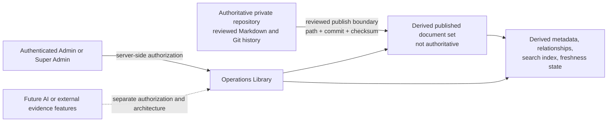

# CTX-ARCH-009 — Operations Library and Knowledge Management Architecture

- **Document ID:** CTX-ARCH-009
- **Status:** **DRAFT — NOT YET APPROVED FOR IMPLEMENTATION**
- **Version:** 0.1
- **Date:** July 22, 2026
- **Owner:** Architecture and Operations Governance
- **Classification:** Internal
- **Approval Authority:** Michael Loren Stiger, CreteXchange Project Owner — approval pending
- **Last Reviewed:** July 23, 2026 — implementation-status reconciliation
- **Next Review:** Event-driven after architecture approval, a material library capability change, or release-readiness review
- **Related discovery:** [CTX-GOV-002 — Documentation Program Health Assessment](../standards/CTX-GOV-002-documentation-program-health-assessment.md)
- **Related Admin architecture:** [CTX-ARCH-004 — Admin Operations Architecture](./admin-operations-architecture.md)
- **Related governance:** [Documentation Library](../README.md), [CTX-STD-001](../standards/cretexchange-platform-standards.md), [Development Protocol](../development-protocol.md), and [ADR-031](./ADR-031-production-database-migration-execution-architecture.md)
- **Supersedes:** None
- **Superseded by:** None

## 1. Executive summary

CreteXchange needs a governed way for trusted Platform Operations users to find and consume the growing repository of architecture, standards, product, release, security, operational, support, and evidence documentation. This draft proposes an **Operations Library** as a separate, first-class, primarily read-only Admin Dashboard capability.

The repository remains the authoritative source. A first implementation may publish an approved, immutable document set and derived metadata/search data, but it must retain repository path, source commit, checksum, status, and freshness evidence. It must not silently make a runtime copy authoritative, present drafts as approved, execute Markdown content, edit documents in-app, or provide AI answers, GeoHaul integration, or sustainability analytics.

This document remains a draft architecture and does not itself authorize production adoption, document editing, approval workflows, scheduled or deployment-triggered refresh, relationship visualization, analytics, or AI. A controlled Version 1 implementation exists in the repository; its implementation and production-adoption evidence remain governed separately.

## 2. Business context and problem statement

The repository contains 117 interconnected Markdown documents across architecture, standards, operations, product, strategy, business, research, UX, release, and archive families. Today, administrators must use the repository structure and Markdown links directly. That preserves governance but makes governed knowledge difficult to discover during operational, audit, investor, grant, and support work.

The problem is not merely document display. The capability must preserve authority, lifecycle, status, provenance, access control, and traceability while improving finding and reading. A generic content-management system, ungoverned search index, or future AI answer that outranks the repository would undermine the existing documentation hierarchy.

## 3. Goals and non-goals

### Goals

- Provide a separate Operations Library entry point for authorized Admin users.
- Make repository-governed documentation discoverable, readable, status-aware, and traceable.
- Prioritize current, approved, authoritative documents without hiding drafts or history from users authorized to see them.
- Preserve source identity, commit identity, checksum, lifecycle, and relationship context in any derived runtime representation.
- Fail safely when publication, indexing, links, or metadata are incomplete.
- Leave a compatible path for later restricted collections, exports, audit packages, semantic search, AI grounding, grant/investor evidence, and sustainability methodology governance.

### Non-goals

- Building a CMS, in-app authoring workflow, repository synchronization job, route, API, schema, search index, or Admin UI now.
- Replacing Git review, approved repository history, or the documentation authority hierarchy.
- Public, Driver, Owner, or general employee self-service access in the first release.
- Raw GeoHaul telemetry, route tracking, fuel calculations, emissions calculations, or cross-product data sharing.
- AI model/provider selection, retrieval-augmented generation, automatic operational action, or AI-driven production changes.

## 4. Current-state discovery and documentation landscape

The factual baseline is preserved in [CTX-GOV-002](../standards/CTX-GOV-002-documentation-program-health-assessment.md). Repository documentation remains the authority source and metadata/lifecycle terminology varies by family. The repository now contains a controlled Version 1 reader, safe Markdown rendering, derived inventory, and audit-oriented synchronization capability; it does not thereby establish an approved publication authority or a production-adoption conclusion.

The existing hierarchy is decisive: a document’s path, age, or search rank cannot determine its authority by itself. Earlier authorities in [docs/README.md](../README.md) take precedence when guidance conflicts.

## 5. Architectural principles

1. **Repository authority first.** Git-reviewed repository content is authoritative; all application data is derivative unless an approved governance document says otherwise.
2. **Status before convenience.** The library must disclose lifecycle, source version, freshness, and applicable authority rather than imply every item is current.
3. **Least privilege.** Server-side authorization applies before metadata, content, search results, downloads, history, or AI retrieval are returned.
4. **Read-only first.** Initial consumption never edits, approves, publishes, or synchronizes documentation through the Admin Dashboard.
5. **Derived data is evidence-bearing.** Derived data carries path, commit, checksum, synchronization state, and source timestamp.
6. **Safe rendering.** Markdown is treated as untrusted content; arbitrary HTML and active embeds are prohibited.
7. **Failure isolation.** Library failures cannot block core Driver, Owner, Admin, financial, or platform operations.
8. **Accessibility and bilingual readiness.** The capability follows existing responsive, keyboard, focus, contrast, text-status, and language practices.

## 6. Capability placement and users

### 6.1 Recommended placement

**Draft recommendation:** Operations Library should be a separate top-level Admin Dashboard page named **Operations Library**, not a subsection of Financial Operations, settings, or a generic help panel. It deserves first-class navigation because it spans governance, releases, operations, support, security, and architecture rather than one business domain.

The future page should provide direct document URLs, browser-history-compatible navigation, breadcrumbs, anchors, related-document links, and deep links from alerts, release records, architecture records, and administrative workflows. Pixel layout is intentionally not specified here.

### 6.2 Users and initial authorization

| User group | Draft posture |
| --- | --- |
| Existing `admin` and `super_admin` | Initial trusted, read-only audience, subject to a future security review. |
| Operations Administrator / technical operator / compliance reviewer / support | Future roles or permission bundles; do not invent them in implementation. |
| Business owner | May use existing trusted Admin access where applicable; separate entitlement is future design. |
| Auditor or investor-view role | Future restricted, explicitly governed access only. |
| Driver, Owner, public user, general employee | Not authorized for the initial capability. |

## 7. Scope horizons

| Horizon | Capability boundary | Status |
| --- | --- | --- |
| **Horizon 1 — Initial Operations Library** | Admin-only read-only listing, categories, safe Markdown, basic metadata/search/filtering, direct and related links, and commit/path/checksum/freshness indication. | Implemented Version 1 in repository; architecture approval and production-adoption evidence remain separate. |
| **Horizon 2 — Governance maturity** | Restricted collections, lifecycle enrichment, relationship graph, historical versions, exports, bookmarks, audit packages, synchronization administration, review dashboards, quality validation. | Deferred. |
| **Horizon 3 — Intelligent knowledge and evidence** | Semantic search, grounded AI, cross-document analysis, grant/investor evidence collections, sustainability methodology governance, controlled GeoHaul-related references. | Future roadmap only. |

## 8. Information architecture and taxonomy

The initial taxonomy should expose repository-backed categories already evidenced, rather than create empty future sections:

| Primary category | Representative scope | Default visibility posture |
| --- | --- | --- |
| Architecture | CTX-ARCH documents, supporting discovery, approvals, verification | Admin-only; authoritative status shown. |
| Architecture Decision Records | ADRs and decision registers | Admin-only; distinguish accepted from draft/rejected/deferred decisions. |
| Standards | CTX standards and mandatory governance | Admin-only; high authority. |
| Product and UX | Product Decisions, UX specifications, data strategy | Admin-only; policy/experience context. |
| Operations and Runbooks | Procedures, checklists, release records, support guidance | Admin-only; classify restricted material before expansion. |
| Project and Delivery | Project context, baseline, roadmaps, sprint context | Admin-only; distinguish active scope from historical plans. |
| Business, Research, Grants, and Strategy | Business architecture, research, vision, grant-readiness evidence | Admin-only; never imply funded, measured, or implemented outcomes. |
| Archive and Historical | Explicit archives and superseded/historical material | Deliberate user action; visibly lower authority. |

Security, privacy, deployment, database, integration, incident, disaster-recovery, investor, sustainability, and GeoHaul groupings are **derived facets**, not empty top-level categories, until repository content and access rules justify dedicated collections.

## 9. Document identity and metadata model

### 9.1 Conceptual identity

A governed document’s stable identity is its logical identifier where present, otherwise a repository path plus durable document identity assigned by an approved normalization process. A displayed runtime copy is identified by at least source repository, path, source commit, and content checksum.

| Field | Initial posture |
| --- | --- |
| Repository path, source commit, content checksum, title, document type, publication/index state | **Required / derived.** |
| Identifier, status, authority level, source timestamp, headings, tags, related links | **Required when declared; otherwise explicit unknown/incomplete.** |
| Version, owner, approver, effective/review/supersession dates, scope, confidentiality, typed relationships | **Recommended and staged.** |
| Bookmarks, recently viewed, access events | **User-specific or audit derived data; never authoritative content.** |

### 9.2 Metadata adoption

Stage 0 inventories and maps existing metadata without rewriting all documents. Stage 1 supports extracted and manually reviewed metadata for high-authority documents. Later work may introduce an approved metadata standard and linting. No parser may fabricate lifecycle or approval status from a filename, date, or heading absence.

## 10. Lifecycle, authority, and precedence

### 10.1 Common lifecycle foundation

The library should use a small common vocabulary—`draft`, `under_review`, `conditionally_approved`, `approved`, `effective`, `superseded`, `archived`, `withdrawn`, `historical`, and `deprecated`—with controlled document-type extensions. Examples: ADRs use accepted/rejected/deferred; release records use planned/in progress/closed; architecture documents can be approved while implementation is still unauthorized. The UI must show the source-declared state and never flatten it into a misleading generic “approved.”

### 10.2 Authority and precedence

The existing [Documentation Hierarchy](../README.md#documentation-hierarchy) is the governing precedence source. The library should display authority level, governing document, source-declared status, supersession links, effective version, and historical/conflict context where known. Search, browsing, and future AI must rank current approved authoritative sources above drafts, archives, and merely recent files; ranking does not override the hierarchy.

## 11. Source of truth, publishing, and synchronization

### 11.1 Source-of-truth decision direction

**Draft recommendation:** retain the private Git repository as authoritative. A published document set, database metadata, object copy, or search index is derivative only. Each derivative must preserve repository identity, path, commit SHA, checksum, and publication state.

### 11.2 Alternatives for runtime content

| Alternative | Benefits | Risks / disposition |
| --- | --- | --- |
| Repository files only | No new runtime system; strongest direct Git authority. | **Rejected as sufficient product answer.** Does not provide Admin discovery/read experience. |
| Static documentation site embedded in app | Fast read performance and easy bundle. | **Deferred.** Must prove secure build publishing, freshness, history, and private-content handling. |
| Repository-backed read-only library | Preserves authority with a bounded application capability. | **Preferred draft direction.** Needs a reviewed publisher and derived metadata model. |
| PostgreSQL authoritative content copy | Queryable and convenient. | **Rejected.** Makes database content appear authoritative and increases drift/authoring risk. |
| GitHub runtime provider | Fresh repository data and history. | **Deferred.** Requires private-repository credentials, rate-limit, outage, token, audit, and cache design. |
| Third-party knowledge platform | Mature search/collaboration features. | **Deferred.** Adds vendor, authority, data-classification, and synchronization complexity. |
| Full CMS | In-app authoring/control. | **Rejected for initial scope.** Conflicts with repository-first governance and expands risk. |
| AI search first | Attractive discovery. | **Rejected for initial scope.** Governance, authorization, citations, and content safety must come first. |
| Hybrid repository-authoritative plus derived index | Supports controlled browse/search while retaining provenance. | **Preferred draft direction.** Exact publish mechanism remains unresolved. |

### 11.3 Freshness and synchronization behavior

Derived inventory refresh must be commit-based, checksum-validated, auditable, and atomic from the reader’s perspective. The implemented manual refresh path is protected by one shared CLI/API production guard: production requires matching explicit target/environment identities plus an authorization value equal to the immutable deployed commit. It is serialized across service replicas with a PostgreSQL advisory lock. Build-time publication, deployment-time publication, scheduled/webhook synchronization, runtime Git retrieval, and hybrid approaches remain deferred alternatives. The UI must show the synchronized source commit and freshness state; if it cannot verify freshness or checksum, it must say so and fail closed for affected content rather than claim currentness.

Rollback means selecting a prior verified inventory generation, not rewriting repository history. A successful inventory generation is not independent document publication: source-declared lifecycle remains authoritative. Partial indexing must either retain the last verified generation with a stale warning or withhold affected documents according to approved policy.

## 12. Runtime storage and derived-data boundaries

| Data class | Authority | Permitted future location |
| --- | --- | --- |
| Governing Markdown and approved Git history | Repository | Repository; immutable published artifact only as derivative. |
| Metadata, checksums, relationships, search index, synchronization state | Derived operational data | PostgreSQL, object storage, or build artifact only after design approval. |
| Bookmarks and recently viewed | User convenience | Application data with user authorization. |
| Access, export, publication, lifecycle, and security events | Audit evidence | Dedicated reviewed audit design; no document body logging. |
| Raw GeoHaul/operational telemetry | Operational/analytics systems | Not Operations Library storage. |

## 13. Rendering architecture

Future rendering must use a maintained Markdown parser and sanitizer allowlist. Raw HTML, scripts, event handlers, iframes, active SVG behavior, unsafe URI schemes, unapproved embeds, and arbitrary external-resource loading are prohibited. Internal links should resolve only to authorized library content or explicit repository links; external links must be labelled and safely handled. Images and attachments require access checks and a reviewed storage/publishing path.

The renderer must support headings/anchors, tables, fenced code, checklists, links, images, and Mermaid only through a reviewed safe renderer. Broken links, unsupported syntax, missing attachments, invalid checksums, and oversized documents produce visible safe warnings. Print/export is deferred. Rendering must not expose paths outside the approved document set or permit path traversal.

## 14. Search, filtering, and discovery

**Draft initial model:** keyword search across authorized title, identifier, path, headings/body text, type, status, owner, tags, and related identifiers, with filters for type, status, authority, current/historical, product/system scope, owner/approver, date, tags, and related CTX-ARCH/ADR. Default results prioritize current, effective or approved, higher-authority content; users deliberately opt into drafts and historical material.

Client-only static search, PostgreSQL full-text search, a prebuilt index, repository search, a dedicated service, and semantic/vector search remain alternatives. A prebuilt derived index is the most compatible draft candidate for the documented scale, but selection is deferred. Search must return status, source path, commit, and relevance rationale sufficient to avoid false authority; it must not omit an authoritative source merely because a lower-authority result matches more words.

## 15. Relationship, versioning, and history

Typed relationships include governs, implements, supports, approves, reviews, verifies, supersedes, superseded by, related to, depends on, evidence for, runbook for, architecture for, decision for, and release implementing. Markdown links may seed candidate relationships, but typed metadata or reviewed derived assertions are required before the UI calls a relationship authoritative.

The initial release should render the published current version and link to repository history rather than render arbitrary historic Git versions. It should display source commit, published timestamp, content checksum, declared version/effective date, and supersession context when available. Full historical version browsing is Horizon 2.

## 16. Authentication, authorization, and security

Initial access is limited to existing `admin` and `super_admin` roles after server-side authorization. Client routing alone is insufficient. The design must support future category-level and document-level classification without presuming every administrator can access every operational, incident, security, investor, or audit document.

Security requirements include least-privilege private-repository access, no credential display or client delivery, secure caching, authorization before metadata/search/content/history/export access, safe download controls, path traversal defense, content sanitization, external-link warnings, redacted logs, and secret scanning for publication artifacts. The library must not log document bodies or leak sensitive snippets in authorization failures, search telemetry, or future AI prompts.

## 17. Audit, observability, accessibility, and availability

Security-significant audit events should include publication/synchronization attempts and outcomes, metadata/lifecycle changes, restricted-content access, downloads/exports, failed authorization, and future AI queries and sources. Ordinary anonymous-like read analytics, if adopted, must be minimized and separated from audit evidence.

The interface must maintain semantic heading order, keyboard navigation, visible focus, logical focus return, text/icon status in addition to color, contrast, screen-reader labels, responsive large-document navigation, clear links, accessible diagram descriptions, printable content where later authorized, and bilingual readiness consistent with CTX standards and UX guidance.

Repository, publisher, index, metadata, checksum, or AI failure must not block core application operations. The library should show last verified content and freshness state only where valid; otherwise it should expose a controlled unavailable/stale/error state. Unauthorized requests return no sensitive content; missing documents and broken links return safe, diagnosable errors.

## 18. Performance and scale

The observed 117-document corpus does not justify internet-scale search infrastructure. Initial design should favor bounded, paginated listings, lazy document loading, cacheable immutable published sets, indexed metadata, and precomputed search where evidence supports it. Performance validation must consider document size, attachment volume, Admin user concurrency, indexing cadence, and mobile rendering before production adoption.

## 19. AI knowledge-assistant boundary

AI is not part of the initial capability. Any future assistant must retrieve only documents the requesting user is authorized to access; favor current approved authoritative sources; cite paths, commits, status, and versions; disclose uncertainty; distinguish source facts from inference; resist prompt injection embedded in documents; avoid secrets; log auditable query/source metadata without leaking content; and never execute operational or production actions solely from generated output. Model/provider, vector store, embeddings, prompts, retention, and evaluation are separate future architecture work.

## 20. Grant, investor, sustainability, and GeoHaul boundaries

The Operations Library may later govern grant applications, investor due-diligence material, sustainability methodologies, reporting definitions, calculation assumptions, report versions, evidence periods, and audit provenance. It must not claim, compute, store, or certify actual mileage, travel-time, fuel, greenhouse-gas, idle-time, productivity, or fleet savings in Horizon 1.

GeoHaul may remain independently operated. Any telemetry or aggregated analytics sharing requires a separate cross-product architecture, privacy review, data-provenance model, authorization model, and sustainability methodology approval. The Operations Library can reference governing documents and evidence packages; it is not a route-tracking system, raw telemetry warehouse, or environmental analytics engine.

## 21. Trust boundaries and proposed data flow

Trust boundaries are: repository governance to publishing; publisher to derived content/index; authenticated user to server authorization; renderer to untrusted Markdown; and future AI/external evidence systems to authorized retrieval. No boundary authorizes a derived system to edit or supersede the repository.

## 22. Recommended architecture and requirements classification

| Area | Draft recommendation | Classification |
| --- | --- | --- |
| Placement | Separate top-level Admin page with deep links and breadcrumbs. | MUST |
| Access | Existing Admin/Super Admin, server-authorized, read-only. | MUST |
| Authority | Repository authoritative; derivatives preserve path/commit/checksum. | MUST |
| Content | Published immutable set plus derived metadata/search; no direct editing. | MUST |
| Metadata | Core derived identity now; staged normalization for richer fields. | SHOULD |
| Lifecycle | Common base with document-type-specific extensions. | SHOULD |
| Search | Keyword/faceted search first; semantic search later. | SHOULD |
| Rendering | Sanitized Markdown and controlled resources only. | MUST |
| Relationships | Reviewed typed relationships; links are candidates only. | SHOULD |
| Audit | Publication/security-significant access events, minimized content logging. | MUST |
| AI / GeoHaul / raw telemetry / public access | Excluded from initial release. | OUT OF SCOPE |

## 23. Risks and mitigations

| Risk | Likelihood | Impact | Mitigation / residual risk | Required stage |
| --- | --- | --- | --- | --- |
| Stale or divergent runtime content | Medium | High | Commit/checksum/freshness display, atomic publication, fail-safe stale state. | Publishing |
| Draft/superseded document presented as current | Medium | High | Lifecycle/status/authority display and default current filter. | Metadata/UI |
| Unauthorized restricted document access | Medium | Critical | Server-side category/document authorization, no client-side trust. | Access-control |
| Malicious Markdown or path traversal | Medium | Critical | Sanitizer allowlist, resource policy, canonical path enforcement. | Rendering |
| Incomplete metadata | High | Medium | Staged normalization and explicit unknown state; never infer approval. | Inventory |
| Search buries authority | Medium | High | Authority-aware ranking and result disclosure. | Search |
| Library outage affects operations | Low | High | Isolate route/service and degrade independently. | Runtime |
| Token/credential leakage | Medium | Critical | Server-only credentials, least privilege, redaction, no runtime Git assumption. | Publishing |
| Uncontrolled editing | Medium | High | Repository-only authoring in Horizon 1. | Governance |
| Future AI hallucination/prompt injection | High | High | Separate architecture, authorized retrieval, citations, no execution. | Horizon 3 |
| Unsupported sustainability claims | Medium | High | Methodology/provenance governance; no calculations in library. | Future evidence |

## 24. Unresolved decisions and follow-on work

The following require review before implementation: exact publishing mechanism; runtime content location; metadata manifest/specification; status parser and normalization ownership; category/document permission policy; repository credential model; renderer/sanitizer; search technology; typed-relationship authoring process; cache/history/rollback behavior; audit retention; export policy; and operational ownership.

Recommended follow-ons, not created here: a Document Metadata and Lifecycle Standard; a repository publishing ADR; a document search architecture ADR; an AI knowledge-grounding architecture; a GeoHaul and CreteXchange sustainability intelligence architecture; and a restricted-document access policy. None is authorized by this draft.

## 25. Proposed implementation stages

| Stage | Objective and completion evidence | Boundaries / prohibited shortcuts |
| --- | --- | --- |
| 0 — Normalization discovery | Inventory, authority mapping, metadata-gap assessment, classification proposal. | Do not rewrite every legacy file or infer status. |
| 1 — Publishing design | Approve source/publish/checksum/freshness/rollback design and threat model. | Do not make a derived store authoritative. |
| 2 — Admin shell | Implement separately authorized navigation, list/detail routes, and Admin-only server authorization. | No public access or direct editing. |
| 3 — Safe rendering | Test sanitized Markdown, links, attachments, accessibility, errors, and path boundaries. | No raw HTML or active embeds. |
| 4 — Metadata and relationships | Add reviewed taxonomy, filters, status, provenance, and typed links. | Do not treat inferred links as facts. |
| 5 — Search | Validate authorized keyword/faceted results, ranking, pagination, and stale behavior. | No semantic/AI search by default. |
| 6 — Synchronization and audit | Implement approved publish/reconcile/observability controls and failure handling. | No silent partial/current claim. |
| 7 — Restricted governance | Add approved collections, permissions, history, exports, and review tooling. | No broad role invention. |
| 8 — Evidence collections | Govern export/bundle workflows for audits, grants, and investors. | No unsupported environmental claims. |
| 9 — AI grounding | Separate approved retrieval, citation, security, evaluation, and audit work. | No autonomous execution. |
| 10 — Sustainability references | Govern methodologies and cross-product evidence after separate GeoHaul/privacy architecture. | No raw telemetry warehouse or calculations here. |

Each stage requires explicit scope, security, accessibility, testing, operational-readiness, and change authorization before work begins.

## 26. Testing and operational-readiness strategy

Future testing must cover authorization before search/content/history/download; sanitizer adversarial cases; internal/external/broken link behavior; path traversal; status and authority display; checksum/freshness divergence; partial/failed publication; search completeness/ranking; responsive keyboard/screen-reader behavior; document inventory integrity; caching/rollback/disablement; audit redaction; and load behavior for expected document size and Admin use.

Operational readiness requires named content/governance owners, support and incident handling, source/publish runbook, stale-content policy, rollback/disablement procedure, audit-retention policy, monitoring, release evidence, and a documented manual recovery path. Any future AI, GeoHaul integration, sustainability analytics, or external evidence sharing needs its own acceptance and production-adoption gates.

## 27. Implementation and production-adoption gates

Implementation is prohibited until this architecture is reviewed and approved; supporting ADRs are completed where required; source/synchronization and initial scope decisions are accepted; security, access-control, sanitization, metadata-normalization, test, and branch/change boundaries are approved.

Production adoption is prohibited until authorized implementation, code review, security and authorization testing, sanitizer tests, divergence/stale behavior tests, accessibility/performance validation, inventory and metadata evidence, synchronization evidence, rollback/disablement runbook, operational readiness, production release authorization, observation, and closure are complete.

## 28. Draft status and references

This document is review-ready as a draft, not implementation-ready. It neither changes the application nor grants implementation or production authority.

- [CTX-GOV-002 — Documentation Program Health Assessment](../standards/CTX-GOV-002-documentation-program-health-assessment.md)
- [Documentation Library](../README.md)
- [Project Context](../project/project-context.md)
- [CTX-STD-001](../standards/cretexchange-platform-standards.md)
- [CTX-ARCH-004](./admin-operations-architecture.md)
- [CTX-ARCH-008](./CTX-ARCH-008-production-database-migration-architecture.md)
- [ADR-031](./ADR-031-production-database-migration-execution-architecture.md)
- [Development Protocol](../development-protocol.md)
