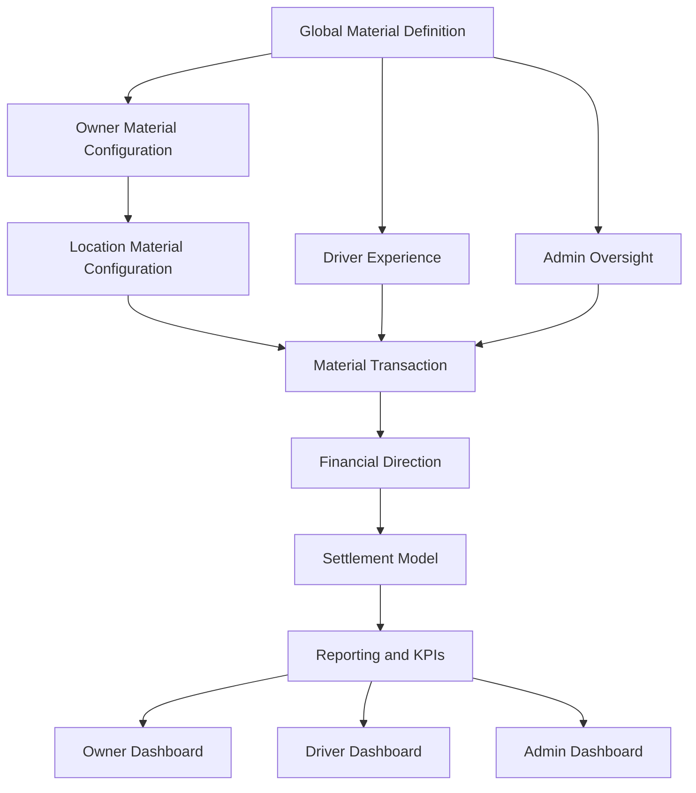

# CTX-ARCH-005 - CreteXchange Material Management Architecture

**Document ID:** CTX-ARCH-005  
**Version:** 1.0  
**Status:** Approved  
**Owner:** V8 Laboratories  
**Product:** CreteXchange  
**Effective Date:** July 2026  
**Purpose:** Authoritative material architecture for taxonomy, operational behavior, financial direction, settlement models, pricing, capacity, compliance, reporting, and extensibility.

**Strategic Context:** [Platform Strategy](../vision/platform-strategy.md), [Data Strategy](../product/data-strategy.md), [Business Model](../business/business-model.md), and [Customer Value Framework](../business/customer-value-framework.md) provide long-term circular-economy, marketplace, data, and customer-value context. This document remains authoritative for material implementation; these references do not redesign architecture or make future capabilities current functionality.

**Driver Incentive Contract:** For an approved `OWNER_PAYS_PROVIDER` transaction using the current driver-incentive model, [CTX-ARCH-006](./driver-incentive-and-financial-settlement-architecture.md) governs snapshot timing, owner-charge components, settlement exclusivity, idempotency, and reporting. CTX-ARCH-005 continues to govern material financial direction and configured settlement model.

## 1. Purpose

CreteXchange is a configurable material exchange platform. This document defines how materials are modeled, priced, routed, settled, reported, and expanded across the platform.

It governs:
- material taxonomy
- operational lifecycle
- financial direction
- settlement handling
- capacity management
- compliance
- reporting
- dashboard KPIs
- future extensibility

## 2. Material Management Philosophy

CreteXchange is not merely a concrete washout application. It is a configurable material exchange platform capable of supporting construction, earth, recycling, industrial, and future material classes.

Material behavior is configuration-driven, auditable, and extensible. Owner configuration, location configuration, and platform policy determine what a material means operationally and financially.

## 3. Guiding Principles

- Materials are configuration driven.
- No material behavior is hardcoded.
- Owner configuration determines operational behavior.
- Financial direction is material specific.
- Platform revenue is independent of material financial direction.
- Material expansion must never require architectural redesign.
- Every material must be operationally and financially auditable.

## 4. Material Lifecycle

- Draft
- Configured
- Published
- Available
- Temporarily Suspended
- Archived

## 5. Material Taxonomy

### Construction
- Concrete
  - Washout
  - Returned Concrete
  - Slurry
  - Hardened Concrete

### Earth
- Dirt
- Fill Dirt
- Topsoil
- Sand
- Gravel
- Rock

### Recycling
- Asphalt
- Asphalt Millings
- Brick
- Block
- Rebar
- Scrap Metal
- Wood
- Plastic
- Cardboard
- Glass
- Mixed Construction Debris

### Industrial
- Future expansion

## 6. Material Definition

Each material shall define:
- Name
- Category
- Description
- Unit of Measure
- Active Status
- Owner Visibility
- Driver Visibility
- Capacity Rules
- Instructions
- Photo Requirements
- Compliance Requirements

### Phase 1 Facility Material Configuration

The first implemented phase uses one standardized `materials` catalog and a
facility-scoped `location_material_intents` association. A system material has a
stable slug, canonical name, category, description, active or retired state,
display order, and optional future icon reference. An owner-defined custom
material is stored only on its facility association; it never silently becomes
a global catalog entry.

A facility association contains exactly one identity: either a system-material
slug or a nonblank custom name. The same system material may be assigned to many
facilities but only once per facility. Custom names are unique per facility
case-insensitively. Associations retain actor and timestamp fields and are
deactivated rather than destructively removed when an owner stops accepting a
material.

Phase 1 supports acceptance state, custom category/description, and owner
instructions. It deliberately does **not** implement material pricing,
financial direction, settlement, driver matching, capacity, restrictions, or
provider execution. Those capabilities remain governed by the relevant later
sections of this architecture and their separately approved Product Decisions.

Existing washout locations receive the active `concrete-washout` catalog
association through an idempotent backfill. The backfill does not rewrite
activities or change owner, driver, payment, wallet, billing, or settlement
records.

## 7. Material Financial Direction

Each material must define one financial direction:

- `OWNER_PAYS_PROVIDER`
  - Example: the yard owner offers an incentive, tip, or payment to the driver or contractor delivering wanted material.
- `NO_CHARGE`
  - Example: a visit with no monetary settlement.
- `PROVIDER_PAYS_OWNER`
  - Example: the driver, contractor, or provider pays the yard owner to accept the material.
- `QUOTE_REQUIRED`
  - Example: acceptance and pricing require manual review, quote, or approval.

## 8. Settlement Model

Supported settlement methods:
- `PLATFORM_MANAGED`
- `DIRECT_SETTLEMENT`
- `OWNER_INVOICE`
- `CONTRACTOR_INVOICE`
- `ACH`
- `CHECK`
- `CASH`
- `PURCHASE_ORDER`
- `EXISTING_ACCOUNT`

Settlement method is configurable per material.

CreteXchange should not assume it is the financial intermediary for every material.

For `PROVIDER_PAYS_OWNER` materials, default settlement should be direct or off-platform unless explicitly configured otherwise.

Direct settlement may include ACH, check, cash, invoice, purchase order, or existing customer account terms.

The platform records the material movement and settlement model even when it does not handle the funds.

## 9. Platform Revenue Model

CreteXchange receives a configurable platform fee for every completed material transaction unless exempted by enterprise contract or platform configuration.

Default platform fee:
- $5.00 per transaction

Future support:
- percentage fee
- tiered pricing
- subscription override
- enterprise pricing
- regional pricing
- promotional pricing

## 10. Material Pricing

For every material define:
- Platform Fee
- Driver Incentive
- Owner Acceptance Fee
- Suggested Market Price
- Owner Override
- Regional Override

## 11. Capacity Management

Define:
- Maximum Capacity
- Current Capacity
- Remaining Capacity
- Thresholds
- Automatic Closure
- Future AI Capacity Forecasting

## 12. Material Acceptance Rules

- Accepted
- Rejected
- Approval Required
- Temporarily Suspended
- Hidden

## 13. Driver Matching

Drivers select a material, and the platform matches them to locations based on:
- accepted materials
- capacity
- hours
- restrictions
- distance
- safety
- owner preferences

## 14. Material Architecture Diagrams

### Overall Material Marketplace

## Material Business Rules

### MR-001 - Platform Fee Applies Per Completed Material Transaction

Every completed material transaction generates a configurable platform fee unless explicitly exempted by enterprise contract, subscription plan, or platform configuration.

The platform fee is independent of:
- material type
- financial direction
- settlement method

Default platform fee:
$5.00 per completed transaction.

### MR-002 - Platform Revenue Is Independent of Material Economics

CreteXchange platform revenue shall not depend upon whether:

- the owner pays the provider,
- the provider pays the owner,
- no money changes hands,
- or a manual quote is required.

Platform revenue is a separate business concern from the commercial relationship between marketplace participants.

### MR-003 - Financial Direction and Settlement Method Are Independent

Financial Direction determines:

Who owes whom.

Settlement Method determines:

How money is exchanged.

Examples:

Owner Pays Provider
+
Platform Managed

Owner Pays Provider
+
Direct ACH

Provider Pays Owner
+
Owner Invoice

Provider Pays Owner
+
Existing Customer Account

These concepts shall never be coupled.

### MR-004 - Provider-Pays-Owner Materials Default to Direct Settlement

When a material requires payment from the provider (driver or contractor) to the owner for acceptance, the default settlement model shall be Direct Settlement.

Supported settlement methods include:

- ACH
- Check
- Cash
- Owner Invoice
- Purchase Order
- Existing Customer Account

CreteXchange shall record the operational transaction but should not act as the financial intermediary unless explicitly enabled by future product policy.

### MR-005 - Owner-Pays-Provider Materials May Use Platform or Direct Settlement

Owners may offer incentives or tips for receiving desirable materials.

Settlement may occur through:

- Platform Managed Payments
- ACH
- Check
- Cash
- Existing Customer Account
- Owner Invoice
- Other configured settlement methods

The settlement method shall be configurable at the material level.

### MR-006 - Material Configuration Is the Single Source of Truth

Every material shall define its operational and financial behavior through configuration.

The platform shall never infer:

- pricing
- financial direction
- settlement method
- acceptance rules
- dashboard behavior

from material names or hardcoded logic.

### MR-007 - Dashboard KPIs Must Respect Material Configuration

All Owner, Driver, Admin, and Reporting dashboards shall derive KPIs from:

- material configuration
- transaction history
- financial direction
- settlement model
- approval status

Dashboard calculations shall never assume all materials behave like washouts.

### MR-008 - Direct Settlement Is Operationally Recorded

When CreteXchange does not process financial settlement, the platform shall still record:

- material transaction
- acceptance status
- operational evidence
- timestamps
- participating parties
- configured settlement model

This ensures complete reporting, analytics, compliance, and auditability.

### MR-009 - Global Platform Fee with Material-Specific Economics

The platform fee is a platform-level pricing policy.

Material economics are material-specific.

Changing the economics of a material shall not require changes to the platform revenue architecture.

### MR-010 - Marketplace Before Payment Processor

CreteXchange is an operational marketplace first.

Financial settlement is a configurable service.

Where practical, financial obligations between owners and providers should be settled directly between those parties to minimize regulatory complexity while preserving complete operational records.

### MR-011 - Configuration Over Custom Development

Any new material, pricing model, settlement method, or operational workflow should be introduced through configuration whenever feasible. Custom code should be the exception rather than the rule.

## 15. Environmental Compliance

Document:
- EPA
- State
- County
- Municipal
- permit tracking
- inspection history
- environmental notes

## 16. Reporting

Material reports:
- capacity reports
- revenue by material
- activity by material
- geographic reports
- environmental reports

Financial reports reference CTX-ARCH-001.

## 17. Material KPI Framework

### Owner Material KPIs

- Accepted Materials
- Active Material Profiles
- Material-Specific Pending Reviews
- Material-Specific Current Receivables
- Material-Specific Potential Charges
- Material-Specific Capacity Remaining
- Loads Received by Material
- Loads Rejected by Material
- Revenue by Material
- Driver Incentives by Material
- Acceptance Fees by Material
- Average Approval Time by Material
- Most Requested Materials
- Most Profitable Materials
- Materials Temporarily Suspended
- Materials Near Capacity

### Driver Material KPIs

- Eligible Materials
- Recent Loads by Material
- Billable Loads by Material
- Earnings by Material
- Rejected Loads by Material
- Preferred Materials
- Nearby Accepting Locations
- Material-Specific Rewards
- Material-Specific Instructions Required

### Admin Material KPIs

- Platform Revenue by Material
- Total Owner Charges by Material
- Driver Incentives by Material
- Acceptance Fees by Material
- Material Demand by Region
- Material Supply by Region
- Rejection Rate by Material
- Capacity Stress by Material
- Top Performing Materials
- Top Performing Yards by Material
- Materials Needing More Locations
- Compliance Exceptions by Material
- Settlement Model Usage by Material
- Direct Settlement Volume by Material

### Reporting KPIs

- Material Volume
- Material Transaction Count
- Material Revenue
- Material Reuse / Diversion Estimate
- Material Capacity Utilization
- Material Acceptance Rate
- Material Rejection Rate
- Material Financial Direction Summary
- Material Settlement Method Summary

Material KPIs must be derived from material configuration and transaction history.

Dashboards must distinguish washout-only KPIs from material-wide KPIs.

Material-specific KPIs must support owner yard customization.

A yard may have different KPIs per accepted material.

Materials with `OWNER_PAYS_PROVIDER`, `PROVIDER_PAYS_OWNER`, `NO_CHARGE`, and `QUOTE_REQUIRED` must be reported distinctly.

Platform fee reporting must remain independent of material financial direction.

Material KPI definitions must reference CTX-ARCH-001 for financial calculations.

## 18. Future Marketplace Vision

Support for:
- Quarries
- Landfills
- Transfer Stations
- Aggregate Plants
- Recycling Centers
- Concrete Plants
- Municipal Recycling
- Industrial Recycling
- Environmental Cleanup

## 19. Architecture Decision Records

### ADR-021 - Material Defines Financial Direction
Decision: Each material must explicitly define how money flows for that material.

### ADR-022 - Settlement Model Is Material Driven
Decision: Settlement method is a material-level configuration, not a hardcoded workflow.

### ADR-023 - Platform Revenue Is Independent Of Material Economics
Decision: Platform fee rules are separate from owner/provider financial direction.

### ADR-024 - Configuration Before Code
Decision: Material behavior must be defined in configuration and architecture before implementation.

### ADR-025 - Material Expansion Without Redesign
Decision: The material model must support new categories and workflows without architectural replacement.

## 20. Codex Engineering Rules

- Never hardcode materials.
- Never hardcode pricing.
- Never assume owner pays provider.
- Never assume provider pays owner.
- Always use configuration.
- Material configuration is the single source of truth.

## 21. Change Governance

All material changes require updates to CTX-ARCH-005 before implementation.
